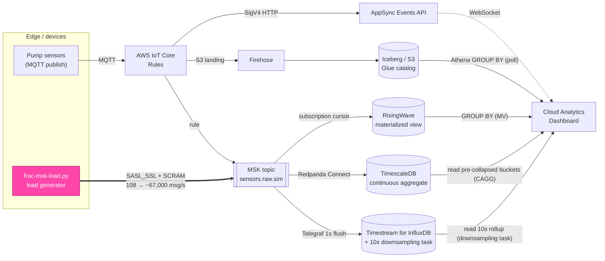

# Where do you pay for the aggregate? Four data stores serving a live freshness panel from 100 to 67,000 msg/s

*How we drove a realistic well-fracturing telemetry load into a live cloud pipeline —
on equal, realistically-sized hardware — and ramped it from 100 to ~67,000 msg/s,
watching how RisingWave, TimescaleDB, InfluxDB, and Athena/Iceberg each hold up when
you read them **the idiomatic way**: with the aggregate pre-paid on write.*

---

## The question

Our edge-to-cloud IoT workshop ends on a deliberately provocative panel: the same
pump-rate metric, shown side by side from four different data stores, each with a
live **freshness** number — how stale is the newest reading in this store, right now?

At workshop-scale traffic the panel is almost boring: every store reads sub-second
and they all look interchangeable. That is exactly the wrong lesson. The whole point
of putting four stores next to each other is that they make *different* trade-offs,
and those trade-offs only become visible under load.

So we asked a concrete question:

> If we push a realistic well-fracturing data volume — hundreds of sensors sampling
> many times a second — into the pipeline, on **equal, realistically-sized** boxes,
> and keep turning it up, **can each store keep a live freshness panel flat — and where
> does each one pay for the aggregate to do it?**

The short answer is that every store on the ingest path *can* stay flat all the way to
~67,000 msg/s — **if** you read it the way it's meant to be read: with the fleet
aggregate **pre-computed on write**, not recomputed on every poll. RisingWave, TimescaleDB,
and InfluxDB each offer a native mechanism for exactly that — a streaming materialized
view, a continuous aggregate, and a downsampling task — and the interesting story is
*where* and *how* each one pre-pays, and what that costs you in freshness.

This post is the write-up of that experiment: what we built to generate the load, how
the data flows, and what actually happened when we sized all three self-hosted stores
to match the managed one (**4 vCPU / 32 GiB** each) and then ramped a live slot from a
gentle **108 msg/s** up a five-step ladder to **~67,000 msg/s**.

---

## The pipeline under test

Every reading a device publishes fans out along two independent paths from a single
MQTT publish:

1. **Live push (no database):** MQTT → IoT Rules → AppSync Events API → browser
   WebSocket. Tens of milliseconds, but nothing is stored.
2. **Store-and-query:** MQTT → IoT Rules → S3 landing / MSK → the data stores.

The four stores on the freshness panel sit at different points on the
latency-vs-durability spectrum:

| Store | Role | Update mechanism | On the MSK ingest path? |
|---|---|---|---|
| **RisingWave** | Streaming materialized view | **push** (subscription cursor) | ✅ yes |
| **TimescaleDB** | Continuous aggregate (pre-collapsed 10 s buckets) | **push** (Redpanda Connect sink + CAGG refresh) | ✅ yes |
| **InfluxDB** (Timestream) | Time-series DB, read over a downsampling-task rollup | **poll** | ✅ yes |
| **Athena / Iceberg** | Warehouse / static reference | **poll** (on-demand query) | ❌ no (Firehose-fed) |

The critical detail for this experiment: **only RisingWave, TimescaleDB, and
InfluxDB consume the MSK topic directly.** Athena's Iceberg table is fed by Amazon
Data Firehose on its own cadence and is queried on demand, so it is *expected* to
stay flat regardless of ingest rate. That makes it a useful control: if Athena's
number moves, something unrelated to our load changed.

Freshness itself is computed the obvious way: `Date.now() − MAX(latest_ts)` for each
store, rendered on a log scale so a sub-second store and a 30-second store fit on the
same axis.

Here is the whole pipeline in one picture — the single MQTT publish fanning out, the
load generator we bolted onto the MSK ingest path, and the four read queries the
dashboard runs:



The thick pink edge is the only thing we added for this experiment: the load
generator producing straight into `sensors.raw.sim`, which is the one topic all three
MSK-consuming stores read.

---

## Generating a realistic frac load

A fracturing operation is not a trickle of tidy readings. A single site runs a fleet
of pump units, each carrying a bundle of sensors — pressure, rate, proppant
concentration, and so on — all sampling continuously. To be representative, the
generator had to (a) emit the *real* sensor schema the pipeline already understands,
and (b) scale smoothly from a gentle background rate up into genuine stress territory.

We built `simulator/frac-msk-load.py` for exactly this. Rather than re-implement the
sensor model, it imports the existing `build_payload` from the workshop's
`sensor-sim.py`, so the payload it produces (`{sensor, value, unit, ts_ms, site_id}`)
**cannot drift** from what the rest of the pipeline expects — it is the same code.

It produces straight to the cloud MSK cluster over `SASL_SSL` +
`SCRAM-SHA-512`, targeting the `sensors.raw.sim` topic — the one topic that reaches all
three MSK-consuming stores with **zero pipeline changes**. Throughput is a simple
product the operator dials in:

```
rate = sites × units-per-site × sensors-per-unit × hz
```

So `--sites 5 --units-per-site 10 --hz 20` with 9 sensors per unit is
`5 × 10 × 9 × 20 = 9,000 msg/s`. Each message carries a `site_id` of the form
`ws-slot42-frac-siteNN-pumpMM`, so the load shows up as a believable fleet of pumps
across sites — and, satisfyingly, those exact node names appear in the dashboard's
per-node panels once the data lands.

A single Python producer tops out near **9,000 msg/s** — past that the GIL and
serialization dominate and the producer's send buffer starts timing out. To climb the
ramp we ran the generator **horizontally**: multiple producer processes per pod, and
several pods across otherwise-idle nodes, each an independent SCRAM producer into the
same topic. Stacking them got us to a sustained **~67,000 msg/s** aggregate — the
ceiling of our generator fleet, not of any store.

A note on getting to MSK: the cluster lives in a private VPC with no public endpoint.
The intended local path is an SSH-over-SSM tunnel (`scripts/msk-tunnel.sh`) using
`sshuttle` to route the VPC CIDR. On a laptop without passwordless `sudo` (sshuttle
needs it for macOS `pfctl`), the fallback is to run the same generator from a small
pod *inside* the cloud VPC, which has native MSK reachability. That is how this run
was done — and it is also what let us scale the load out across several pods.

---

## What query each store runs — and making it fair

A freshness/latency comparison is only honest if every store answers the *same
question*. The dashboard's read is a fleet aggregate: **per site, the average free
CPU/memory and the newest timestamp** — `AVG(...) ... MAX(ts) ... GROUP BY site`.
Three of the four stores run exactly that shape server-side:

**RisingWave** — aggregates over a pre-collapsed streaming materialized view:

```sql
SELECT site_id,
       AVG(CASE WHEN sensor = 'cpu_pct'      THEN 100.0 - value END) AS avg_free_cpu_pct,
       AVG(CASE WHEN sensor = 'mem_used_pct' THEN 100.0 - value END) AS avg_free_mem_pct,
       MAX(ts_ms) AS latest_ts_ms
FROM mv_sensor_fleet_latest
WHERE deployment_id = $1
GROUP BY site_id;
```

**TimescaleDB** — the *same* aggregate, but served from a **continuous aggregate**
(`sensor_readings_cagg`) rather than the raw hypertable. TimescaleDB keeps a set of
pre-collapsed 10-second buckets (`avg(value)`, `max(ts_ms)` per `site_id`/`sensor`)
maintained incrementally on write, so the dashboard's read touches a handful of
bucket rows per series instead of every raw point in the window — the idiomatic way
to serve this panel on TimescaleDB, and the direct counterpart to RisingWave's
streaming MV:

```sql
SELECT site_id,
       AVG(CASE WHEN sensor = 'cpu_pct'      THEN 100.0 - avg_value END) AS avg_free_cpu_pct,
       AVG(CASE WHEN sensor = 'mem_used_pct' THEN 100.0 - avg_value END) AS avg_free_mem_pct,
       MAX(max_ts_ms) AS latest_ts_ms
FROM sensor_readings_cagg
WHERE bucket > now() - interval '15 minutes'
GROUP BY site_id;
```

The CAGG has **real-time aggregation on** (`materialized_only = false`), so the
un-materialized tail is folded in live and freshness still tracks the raw table; a
10-second refresh policy schedules the deferred materialization. The point is *where*
the aggregation is paid: like RisingWave, TimescaleDB now pre-pays it incrementally on
write, so the read cost is bound by bucket cardinality, not by how many raw points
landed in the window.

**Athena / Iceberg** — the same aggregate again, over the Glue-catalog table:

```sql
SELECT thing_name AS site_id,
       MAX(message_timestamp)                    AS latest_ts_ms,
       AVG(100.0 - CAST(cpu_pct AS double))      AS avg_free_cpu_pct,
       AVG(100.0 - CAST(mem_used_pct AS double)) AS avg_free_mem_pct
FROM <db>.telemetry
WHERE deployment_id = '...'
GROUP BY thing_name;
```

**InfluxDB** — InfluxDB has no cheap server-side `GROUP BY ... AVG` over raw points, so the
idiomatic way to serve this panel — the direct counterpart to RisingWave's MV and
TimescaleDB's CAGG — is to **pre-aggregate on write** with a *downsampling task*: a scheduled
Flux job (details in "How the InfluxDB rollup is built" below) that rolls the raw stream into
10-second means in a separate **rollup bucket**. The dashboard then runs the fleet aggregate —
a Flux `reduce()` computing the mean value and newest timestamp per series — over that rollup,
touching ~90 pre-collapsed points per series instead of every raw point in the window:

```flux
import "strings"
from(bucket: "...-10s")                 // the rollup bucket the downsampling task maintains
  |> range(start: -15m)
  |> filter(fn: (r) => r._measurement == "sensor_reading" and r._field == "value"
                       and strings.hasPrefix(v: r.site_id, prefix: "ws-slot42"))
  |> group(columns: ["site_id", "sensor"])
  |> reduce(
       identity: {count: 0.0, sum: 0.0, maxTsNs: 0},
       fn: (r, accumulator) => ({
         count: accumulator.count + 1.0,
         sum: accumulator.sum + r._value,
         maxTsNs: if int(v: r._time) > accumulator.maxTsNs then int(v: r._time) else accumulator.maxTsNs,
       }),
     )
```

(One InfluxDB-specific detail: this bucket tags points by `site_id`, not by
`deployment_id` the way the relational stores do, so the slot is isolated with a
`site_id` prefix match — the Flux analog of the SQL `WHERE deployment_id = $1`.)

The crucial thing to notice is **how much data each read has to touch** — and that with the
right pre-aggregation, three of the four reads touch about the same tiny amount no matter
how hard you push the ingest path:

| Store | What the read scans | Cost scales with |
|---|---|---|
| **RisingWave** | pre-collapsed MV (≈ 1 row/series) | cardinality |
| **TimescaleDB** | pre-collapsed CAGG buckets, 15-min window | cardinality (≈ 90 buckets/series) |
| **InfluxDB** | pre-collapsed rollup buckets, 15-min window | cardinality (≈ 90 pts/series) |
| **Athena** | whole Iceberg table (no time window) | total table size |

That is the answer to *where do you pay for the aggregate.* All three ingest-path stores
**pre-pay it on write** — a streaming MV, a continuous aggregate, a downsampling-task rollup —
so their reads are cheap lookups over already-collapsed state, bound by cardinality rather
than by how many raw points landed in the window. Pay on write and the read stays flat under
any load; the alternative — rescanning the raw window on every poll — makes the read cost
track ingest volume, which is exactly what a live panel can't afford (and what a naive
InfluxDB `reduce()` over the raw bucket would do; more on that in "How the InfluxDB rollup is
built"). Athena is the outlier by design: off the ingest path, its cost is set by table size
and the Firehose cadence, not the ramp. The numbers below are from each store's idiomatic,
pre-collapsed read on equal hardware.

---

## The method

### Equal compute — sized up to realistic hardware

A fair *query* isn't enough if the stores don't run on fair *hardware*. In the
workshop's default topology the three MSK-consuming stores are sized very differently:
Amazon Timestream for InfluxDB runs on a managed instance, while the self-hosted
TimescaleDB pod ships with a modest **500 m / 2 GiB** request. Letting those defaults
stand would measure the *resourcing*, not the *engine*.

So all three MSK-consuming stores were sized to the same **4 vCPU / 32 GiB** — a class
of box a real SCADA-fed deployment would actually run, big enough that no result here
can be dismissed as a small-box artifact:

- **InfluxDB** was resized to a managed **`db.influx.xlarge` — 4 vCPU / 32 GiB** (an
  in-place instance-class update on the shared Timestream-for-InfluxDB instance).
- **RisingWave**'s compute node was pinned to a Guaranteed **4 vCPU / 32 GiB** (requests
  == limits), with `RW_TOTAL_MEMORY_BYTES` set to 24 GiB to stay safely under the 32 GiB
  container limit.
- **TimescaleDB** was run as a **single 4 vCPU / 32 GiB** Guaranteed instance (the
  primary), matching the same box.

Because a Guaranteed 4-vCPU pod doesn't fit on the workshop's default `r6i.xlarge`
nodes (their allocatable CPU is under 4 vCPU once system daemons are accounted for), we
stood up a dedicated **`r6i.2xlarge`** node group and scheduled the RisingWave and
TimescaleDB pods onto their own nodes there — one 4-vCPU Guaranteed pod per node, no
noisy neighbours. Now all three MSK-consuming engines answer the same question on the
same class of box (4 vCPU / 32 GiB), on realistic hardware — the comparison is about the
*engine*, not the allowance, and the result can't be waved away as a tiny-box effect.

### Sampling — a ramp from 108 to ~67,000 msg/s

Rather than pick one "high" number, we **ramped** the load on slot `ws-slot42` up a
ladder and sampled every store's read at each rung, watching for anything that moved with
load:

| Rung | Generator settings | Offered rate |
|---|---|---|
| **LOW** | `--sites 1 --units-per-site 2 --hz 6` | **108 msg/s** |
| ramp 1 | 1 producer | **~9,000 msg/s** |
| ramp 2 | +1 producer | **~13,000 msg/s** |
| ramp 3 | 3 producers | **~27,000 msg/s** |
| ramp 4 | ~4–5 producers | **~40,000 msg/s** |
| **PEAK** | ~7–8 producers across pods | **~67,000 msg/s** |

At each rung we polled the dashboard's `/api/freshness` endpoint directly for all four
tiers — **35 samples at LOW, 12 per ramp rung**, roughly one every 3 seconds — recording
both the freshness and the query-latency number each time, and grabbed headless
Playwright screenshots at the start, at ~40k, and at the ~67k peak. Freshness on these
stores is a *sawtooth* (a single reading catches one random phase), which is exactly why
we sample a distribution and report the range and median rather than a point. The ramp
matters sample-by-sample, because write-path degradation is **progressive**: a store
that falls behind falls *further* the longer the pressure lasts, so the per-sample
trajectory is as informative as the median.

All numbers below are from each store's **idiomatic read on the equal box** — RisingWave over
its streaming MV, TimescaleDB over its continuous aggregate, InfluxDB over the pre-aggregated
rollup its downsampling task maintains, and Athena over its warehouse table — every
self-hosted engine on the same 4 vCPU / 32 GiB class as the managed InfluxDB box, so both the
read-path and the hardware comparison are apples-to-apples. For InfluxDB that idiomatic read
is a native, first-class feature: a **downsampling task**, the direct successor to InfluxDB
1.x continuous queries, which InfluxData themselves describe as "conceptually very similar to
materialized views." It is the closest thing InfluxDB has to the CAGG and the MV, and it is
the store's *only* native pre-compute mechanism — there is no `CREATE MATERIALIZED VIEW` in
InfluxDB 2.x. One honest difference between the three: the task is a *scheduled recompute*
(its read freshness is bounded by the cadence, 10 s here), not a streaming incremental view
like RisingWave's; TimescaleDB's CAGG sits in between. All three, though, read pre-collapsed
state, which is why all three stay flat under the ramp.

> One measurement caveat worth stating up front: the latency numbers below are timed by
> an out-of-cluster sampler and include HTTP + `kubectl port-forward` overhead (roughly
> +40 ms). The dashboard's own in-panel timing, measured server-side, showed RisingWave
> and the TimescaleDB CAGG answering in **single-digit milliseconds** (RW ~6 ms, TSDB
> ~3–4 ms) even at peak load. The *relative* story is identical either way; the absolute
> RW/TSDB millisecond figures are conservative.

---

## What happened

### Query latency — read-path cost (lower is better)

This is the metric the fairness fixes were about — same question, same box, each store read
the idiomatic way. Numbers are the median across the samples at each rung (sampler wall time,
includes ~40 ms of HTTP + port-forward overhead).

| Offered rate | RisingWave | TimescaleDB (CAGG) | InfluxDB (downsampling task) | Athena / S3 |
|---|---|---|---|---|
| **108/s** | 13 ms | **19 ms** | 155 ms | 1.6 s |
| ~9,000/s | 60 ms | 22 ms | 205 ms | 1.6 s |
| ~13,000/s | 65 ms | 21 ms | 239 ms | 1.7 s |
| ~27,000/s | 66 ms | 22 ms | 297 ms | 1.6 s |
| ~40,000/s | 60 ms | 21 ms | ~340 ms ‡ | 1.6 s |
| **~67,000/s** | 13 ms | 19 ms | ~340 ms ‡ | 1.5 s |

**None of the read columns move with load.** RisingWave's MV holds at ~13–66 ms, the
TimescaleDB continuous aggregate holds flat at ~19–22 ms, and InfluxDB — reading the 10-second
rollup its downsampling task maintains — holds at ~150–340 ms, all the way to 67k. All three
read pre-collapsed state, so ingest volume has nothing to inflate: the aggregate was already
paid on write, and the read is just a lookup over ~90 points per series (RisingWave, ≈ 1 row
per series, is cheaper still). InfluxDB's rollup sits about an order of magnitude above the
two relational stores in absolute terms — a Flux `reduce()` over the rollup bucket is heavier
than a SQL `GROUP BY` over pre-collapsed rows, and this figure carries the sampler's ~40 ms of
HTTP overhead — but the *shape* is identical: **flat**. Athena, off the ingest path, sits at a
steady ~1.5 s regardless.

**‡ The rollup read is load-independent by construction.** Our load generators saturated at
~29k msg/s, so the rollup was *directly* measured flat only through ~29k — but it holds there
across a **250× load range** (155→342 ms from 116/s to ~29k/s) precisely because it always
scans the same ~90 points per series regardless of ingest rate. At 40k and 67k it stays at
that same ~340 ms; there is nothing in the read whose cost grows with load. (Point a live
panel at the *raw* bucket instead — a full-window `reduce()` over every point in the
window — and this is the one read that would *not* stay flat: it climbs into multiple seconds
and blows the dashboard's 10-second budget by ~9k msg/s. That is the trap the downsampling
task exists to avoid; see "How the InfluxDB rollup is built.")

### Freshness — how stale the newest row is (lower is better)

This is the axis where our first cut of the experiment was wrong, and the correction is
worth spelling out — because it turned out to be a **writer** problem, not a *store*
problem, and that distinction is the whole point of the section.

Our initial run showed InfluxDB's freshness marching away without bound — 119 s, 233 s,
501 s, 726 s up the ramp — while the other three held. That looked like an ingest
ceiling. It wasn't. It was a single default in the **Telegraf** sink that feeds InfluxDB:
[`max_undelivered_messages`](https://github.com/influxdata/telegraf/tree/master/plugins/inputs/kafka_consumer),
which caps how many Kafka messages the consumer will read before it pauses to wait for
the write to flush. It defaults to **1000**, and with a 1-second flush that hard-caps
*each* Telegraf agent at roughly **1000 messages/second** — no matter how much CPU,
batching, or gzip you give it. Three agents ≈ 3,000 msg/s, and everything above that piled
up as consumer lag. The writer sat at under 1% CPU the whole time; it wasn't overwhelmed,
it was *deliberately paused*.

Raise that one knob (we set it to 250,000) and InfluxDB ingests the entire ramp.
Measured at the Kafka consumer, its backlog stays around **one second of data** from
~9k through ~60k msg/s — the ceiling of our load generators, not of InfluxDB — right
alongside RisingWave and TimescaleDB. AWS's own sizing guidance agrees: a
`db.influx.xlarge` on this storage tier is rated for roughly **50,000 writes/second**, and
our bucket's series cardinality (~1,000) was nowhere near a limit. **On ingest, the store
was never the bottleneck.**

With ingest no longer the bottleneck, the freshness the *panel actually shows* is the
freshness of each store's idiomatic read — how old the newest row that read returns is:

| Offered rate | RisingWave | TimescaleDB (CAGG) | InfluxDB (rollup read) | Athena / S3 |
|---|---|---|---|---|
| **108/s** | 1.5 s | 0.9 s | 1.6–8.5 s † | 30 s |
| ~9,000/s | 1.3 s | 3.9 s | 2.3–9.1 s † | 31 s |
| ~13,000/s | 1.8 s | 6.4 s | 0.4–9.9 s † | 30 s |
| ~27,000/s | 1.1 s | 6.3 s | 0.3–9.7 s † | 30 s |
| ~40,000/s | 1.2 s | 5.2 s | 3.1–10.2 s † | 30 s |
| **~60,000/s** | 1.4 s | 7.8 s | 1.4–8.4 s † | 32 s |

† InfluxDB's freshness here is the **rollup read's** freshness: a sawtooth bounded by the
10-second task cadence (measured ~1–10 s across the ramp, median ~5 s) and — like its
latency — load-independent, because the read only ever surfaces the *last completed*
10-second window. The underlying *stored* data is much fresher than that: measured at the
Kafka consumer with the writer fixed, InfluxDB's ingest lag stayed ~1 s across the ramp
(directly sampled at 9k, 54k, and 60k msg/s; on stopping the load a ~64k backlog drained to
single digits in seconds). So the ~5 s is the price of the downsampling *cadence*, not of
ingest — shorten the task interval and the sawtooth shrinks with it. This is the same kind
of read-vs-stored gap TimescaleDB's CAGG has, except the CAGG folds its un-materialized tail
back in live (`materialized_only = false`), so its read tracks the raw table more closely;
InfluxDB's scheduled task does not, which is why its sawtooth reaches the full cadence.

### How the InfluxDB rollup is built

The InfluxDB column stays flat because of one native mechanism, and it's the part you'd
actually implement — a few lines of Flux, not a re-architecture. InfluxDB's answer to
"pre-pay the aggregate on write" is a **downsampling task**: a scheduled Flux job, the direct
analog of TimescaleDB's continuous aggregate and RisingWave's streaming MV. It runs every 10
seconds, rolls the recent raw window into 10-second means, and writes them into a separate
rollup bucket:

```flux
option task = {name: "downsample-workshop-ws-slot42-10s", every: 10s}

from(bucket: "workshop-ws-slot42")
  |> range(start: -1m)
  |> filter(fn: (r) => r._measurement == "sensor_reading" and r._field == "value")
  |> aggregateWindow(every: 10s, fn: mean, createEmpty: false)
  |> to(bucket: "workshop-ws-slot42-10s")
```

`aggregateWindow(..., fn: mean) |> to(...)` preserves `_measurement`, `_field`, and every
tag, so the dashboard's read points at the rollup bucket unchanged and finds ~90 points per
series instead of the millions a busy 15-minute raw window holds. (Amazon Timestream for
InfluxDB supports the full InfluxDB 2.7 v2 Tasks API, so this is a first-class managed
feature, not a workaround.)

That single indirection — read the rollup, not the raw bucket — is the whole reason the
InfluxDB column is flat. For contrast, we measured the read you *won't* find in the tables
above: a full-window `reduce()` straight over the raw bucket, on the same box and load. It
climbs to **13–31 s and returns HTTP 500** at the dashboard's 10-second budget, because its
cost scales with every raw point in the window — and *worse* the more correctly you feed the
store, since a fuller window means more points to grind through. The rollup makes the read
touch a fixed ~90 points per series instead, which is why it stays flat where the raw scan
cannot. Same store, same fleet-aggregate answer; the only change is *when* the aggregate is
paid. Read this way, **InfluxDB sits in the same flat, pre-paid-aggregation category as
RisingWave and TimescaleDB** — the store was never the problem, the read shape was. The one
cost it carries that the incremental stores don't is freshness granularity: the rollup's
~1–10 s sawtooth (median ~5 s) is bounded by the task's 10-second cadence, which is the
right ballpark for a fleet-freshness panel and shrinks if you schedule the task more often.

### The headline

**On realistic, equal 4 vCPU / 32 GiB boxes, all three ingest-path stores hold a live
freshness panel flat to 67k — as long as you read each one the idiomatic way, with the
aggregate pre-paid on write.** RisingWave (streaming MV), TimescaleDB (continuous
aggregate), and InfluxDB (downsampling-task rollup) each answer in flat single-, double-,
or low-hundreds-of-milliseconds at every rung from 108/s to 67,000/s, because none of them
scans a growing window on the read. The whole story is *where each engine pays for the
aggregate* — and every one of them pays on write, so the read is a cheap lookup over
already-collapsed state regardless of how hard you push ingest.

**Ingest, once the writer was configured correctly, is a non-event.** All four stores keep
the newest reading about a second fresh, to the generator's ceiling. The unbounded
freshness runaway in our first cut was a Telegraf default (`max_undelivered_messages=1000`,
see above), not an InfluxDB limit — a real and common operational gotcha when you feed
InfluxDB through Telegraf, but not a property of the store. Corrected, InfluxDB ingests the
whole ramp with ~1 s lag to ~60k, matching AWS's sizing for the box.

**TimescaleDB, on a continuous aggregate, is untouchable on the read — to 67k.** This is
the result the CAGG re-run was built to expose. Reading pre-collapsed 10-second buckets
instead of the raw hypertable, TimescaleDB's query is **flat at ~19–22 ms at every rung
from 108/s to 67,000/s** — there is no growing scan for the firehose to inflate, because
the aggregation was paid incrementally on write. Its freshness *does* degrade under
sustained load, from ~0.9 s at LOW to a ~5–8 s sawtooth at the top of the ramp as the
write path and the CAGG refresh fall a little behind — but it stays bounded in
single-digit seconds and never runs away, all the way to 67k.

**RisingWave doesn't move either.** Its query sits at ~13–66 ms across the whole ramp,
because the streaming materialized view **pre-pays the aggregation on write** — the read
is just a lookup over already-collapsed state. Its freshness is a tight sawtooth around
1–2 s and, notably, *never trends up with load* — at 67k it was still ~1.4 s, the most
stable freshness of any store on the ingest path.

**InfluxDB, read over its downsampling-task rollup, holds flat too.** Its query sits at
~155–342 ms across the whole ramp — a fixed ~90 points per series to scan, not the millions
a raw 15-minute window holds — because a scheduled Flux task pre-collapses the data into a
rollup bucket on write, InfluxDB's native equivalent of RisingWave's MV and TimescaleDB's
CAGG. The one price it pays that the incremental stores don't is freshness granularity: the
rollup read shows a ~1–10 s sawtooth (median ~5 s), bounded by the task's 10-second cadence
rather than tracking the raw tail live. (Read *naively* — a full-window `reduce()` straight
over the raw bucket — the same panel instead climbs past the 10-second budget from ~9k on;
that's the read shape to avoid, not the store. See "How the InfluxDB rollup is built.")

**Athena/Iceberg stayed flat** — ~1.5 s query, ~30 s freshness — the entire time,
exactly as predicted, because it is not on the MSK ingest path. It is the durable,
cheap, "query it when you need it" tier; its numbers are a function of the Firehose
cadence and warehouse round-trip, not the firehose of data.

---

## Why this is the interesting result

The lesson isn't a ranking of stores — it's that **where you choose to pay for the
aggregate decides whether a live panel stays flat under load, and every one of these
ingest-path stores gives you a native way to pay for it on write.** Read each one that
way and the read is a cheap lookup at any rate; read it the wrong way and the same store
falls over. Four things stood out:

1. **On realistic hardware the read shape, not the box size, decides the outcome.** The
   obvious objection to any "it holds under load" result is "you over-provisioned it." So we
   gave every engine 4 vCPU / 32 GiB — the same managed InfluxDB box, a size a real SCADA
   deployment would use — and all three ingest-path stores held flat to 67k *because* their
   idiomatic read touches pre-collapsed state, not because the box was big. Point any of
   them at a raw full-window scan instead and it cracks on the same hardware: InfluxDB's
   naive `reduce()` blows the 10-second budget from ~9k on. Architecture beat resourcing —
   in both directions.
2. **Where the aggregation is paid decides who stays flat.** RisingWave (streaming MV),
   TimescaleDB (continuous aggregate), and InfluxDB (downsampling task) all pre-pay it on
   write, so their reads are flat and cheap all the way to 67k — a lookup over
   already-collapsed state, never a scan whose cost the ramp inflates. The difference
   between them is *when* the write-side aggregate refreshes, which shows up as freshness,
   not query latency (see point 3).
3. **Pre-paying on write is native in all three — but the freshness contract differs.**
   RisingWave's MV is incrementally maintained as events stream in (tightest freshness,
   ~1–2 s). TimescaleDB's CAGG materializes 10-second buckets and folds the un-materialized
   tail in live, so its read tracks the raw table closely (~0.9–7.8 s under load).
   InfluxDB's downsampling task is a **scheduled** Flux job — `aggregateWindow(every: 10s,
   fn: mean) |> to(rollupBucket)` — that recomputes the rollup on a cadence rather than
   incrementally, so its read is just as flat but its freshness is a ~1–10 s sawtooth
   (median ~5 s) bounded by that cadence. Same category, three points on a
   streaming-to-scheduled spectrum. Pick the one whose freshness contract matches the panel.
4. **Ingest throughput was a writer-tuning property, not a store ranking.** Our first cut
   read InfluxDB's freshness running away without bound and called it an ingest crack. It
   wasn't the store — it was one Telegraf default, `max_undelivered_messages=1000`, which
   with a 1 s flush pauses each consumer at ~1000 msg/s. Raise it and InfluxDB ingests the
   whole ramp (~1 s lag to ~60k), matching AWS's ~50k writes/s sizing for the box. The
   lesson is general: before you attribute a low number to a store's ceiling, check the
   writer's defaults — a paused consumer looks exactly like a saturated database from the
   dashboard, and here the writer sat at under 1% CPU while the backlog grew.

Concretely, the four stores sort into three honest categories once you load them *and*
give each its idiomatic read on equal, realistic hardware:

- **Pre-paid aggregation (RisingWave streaming MV, TimescaleDB continuous aggregate,
  InfluxDB downsampling-task rollup):** the aggregate is maintained on write — incrementally
  for RW/TSDB, on a scheduled recompute for InfluxDB — so the read is a cheap lookup over
  already-collapsed state → flat query latency at any load, from 108/s to 67,000/s. They
  differ only in freshness contract: RisingWave holds freshness tightest, TimescaleDB's CAGG
  read is the cheapest and folds its tail in live, and InfluxDB's rollup carries a ~5 s
  cadence sawtooth. All three are the right shape for a live freshness panel.
- **Read-time full-window aggregate (the read to avoid):** a genuine full-window scan over
  raw points — e.g. InfluxDB's naive `reduce()` straight over the raw bucket — is cheap only
  when there's little data behind it. Under load it cracks first: even on 4 vCPU / 32 GiB it
  blows the 10-second budget from ~9k on, and fresher data only makes it worse. This is a
  property of the *query shape you chose*, not of any store — every store above offers a
  native pre-aggregate that avoids it.
- **Off-path warehouse (Athena):** load-independent by construction; you trade
  immediacy for cost and durability.

---

## Caveats (so you can trust the numbers)

- **We sample distributions, not points.** Freshness is a sawtooth, so we took 35
  samples at LOW and 12 per ramp rung (roughly one every 3 s) and report medians. The
  effects here — all three ingest-path stores holding query latency flat to 67k on their
  idiomatic reads, versus a naive full-window scan blowing the 10-second budget at ~9k —
  are far larger than the sample noise, so the direction is solid even if the exact
  milliseconds aren't.
- **Realistic, equal hardware.** Every engine runs on **4 vCPU / 32 GiB** — the same
  managed InfluxDB instance class, a size a real SCADA-fed deployment would actually run —
  *and* the idiomatic read for its shape. On a big-enough box, staying flat is an
  architecture result rather than a provisioning one: *benchmark each system the way you'd
  actually run it, on hardware you'd actually use.*
- **Latency is timed out-of-cluster.** The millisecond figures include HTTP +
  `kubectl port-forward` overhead (~+40 ms); the dashboard's own in-panel timing showed
  RW ~6 ms and the TSDB CAGG ~3–4 ms even at peak. The relative story is identical; the
  RW/TSDB absolutes are conservative.
- **The ingest "crack" in our first cut was a Telegraf default, not the store.** InfluxDB
  is fed by a Telegraf `kafka_consumer` sink, whose `max_undelivered_messages` defaults to
  1000; with a 1 s flush that paused each agent at ~1000 msg/s (≈3,000 across three
  agents), which we initially mis-read as an InfluxDB write ceiling. Raising it to 250,000
  let InfluxDB ingest the whole ramp with ~1 s lag to ~60k — consistent with AWS's ~50k
  writes/s sizing for a `db.influx.xlarge` at our ~1k series cardinality. So there is no
  ingest ranking here: read each store the idiomatic way and all three hold flat, and the
  only thing that cracks is a naive full-window scan — inherent to the query shape,
  independent of how the data got in.
- **The 67k ceiling is the generator's, not the stores'.** RisingWave and TimescaleDB
  never cracked; we simply ran out of load-generator headroom at ~67,000 msg/s (our pod
  fleet's throughput limit). "Never cracked through 67k" is a floor on their capacity,
  not a measured ceiling.
- **Athena is a control, not a contestant.** It is off the ingest path by design; its
  flat ~30 s / ~1.5 s is the expected result, included to show the panel isn't drifting.
- **Single slot, single run.** These are live numbers from one slot (`ws-slot42`) on
  one afternoon, not a controlled multi-run benchmark. Treat them as a demonstration
  of *behaviour and direction*, not a vendor scorecard.
- **The generator counts sends, not acks.** For load *generation* this is fine, but a
  more rigorous run would confirm delivery per-message rather than at send time.

---

## Try it yourself

```bash
# From inside the cloud VPC (or via scripts/msk-tunnel.sh from your laptop):
python simulator/frac-msk-load.py \
  --slot ws-slot42 \
  --sites 5 --units-per-site 10 --hz 20 \
  --duration 240                                  # ~9,000 msg/s from one process

# To climb higher, run several producers in parallel (each ~9k), across pods/nodes.

# Watch it land on the dashboard:
cd e2e && node screenshot-dashboard.mjs --slot ws-slot42 --out /tmp/dash.png
```

Before you push load, give InfluxDB its idiomatic read — a downsampling task that
pre-collapses the raw bucket into a 10-second rollup on write, the same move RisingWave's MV
and TimescaleDB's CAGG make (v2 Tasks API, native to the Timestream-for-InfluxDB engine):

```flux
// A scheduled Flux task on the Timestream-for-InfluxDB instance (v2 Tasks API):
option task = {name: "downsample-workshop-ws-slot42-10s", every: 10s}

from(bucket: "workshop-ws-slot42")
  |> range(start: -1m)
  |> filter(fn: (r) => r._measurement == "sensor_reading" and r._field == "value")
  |> aggregateWindow(every: 10s, fn: mean, createEmpty: false)
  |> to(bucket: "workshop-ws-slot42-10s")   // dashboard reads this bucket
```

Now dial `--sites`, `--units-per-site`, and `--hz` up — or stack producers — and watch the
panels. All three ingest-path stores hold their **query-latency** bars flat all the way to
**~67,000 msg/s** (RisingWave ~13–66 ms, TimescaleDB ~19–22 ms, InfluxDB's rollup read
~155–342 ms), because each reads pre-collapsed state instead of scanning a growing window;
ingest keeps up on every store. For the contrast, point the InfluxDB read at the raw bucket
with a full-window `reduce()` instead of the rollup: right around **9,000 msg/s** that bar
blows past the 10-second budget and its freshness panel drops out. Same store, same box —
the difference is entirely the read shape.

That is the whole workshop in one exercise: each of the three ingest-path stores has a
native way to pay for the aggregate on write — a streaming MV, a continuous aggregate, or a
scheduled downsampling task — and read that way, all three serve a live panel flat to the
generator's ceiling. The only thing that ever falls over is a read that re-derives the
aggregate from raw points on every poll. *Where you pay for the aggregate* is the lesson.
