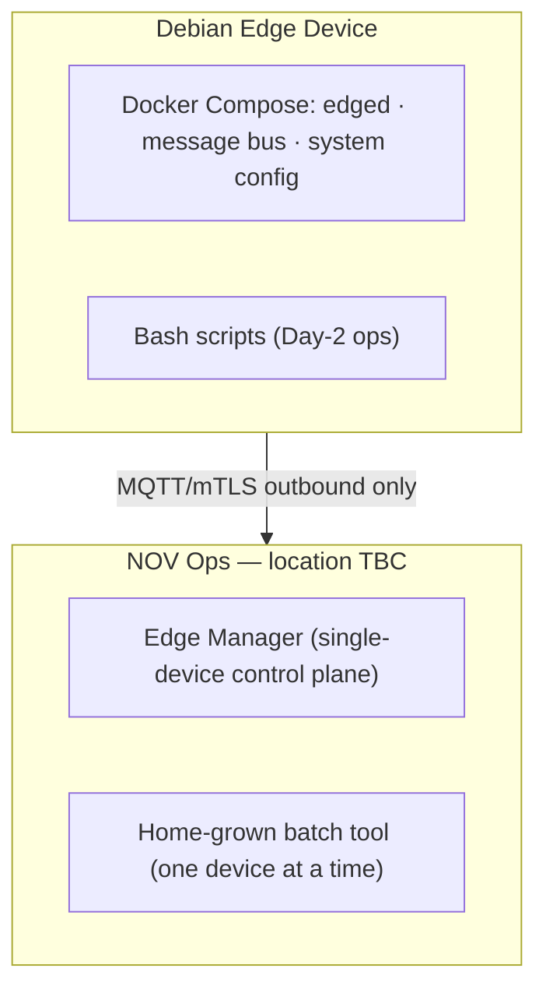
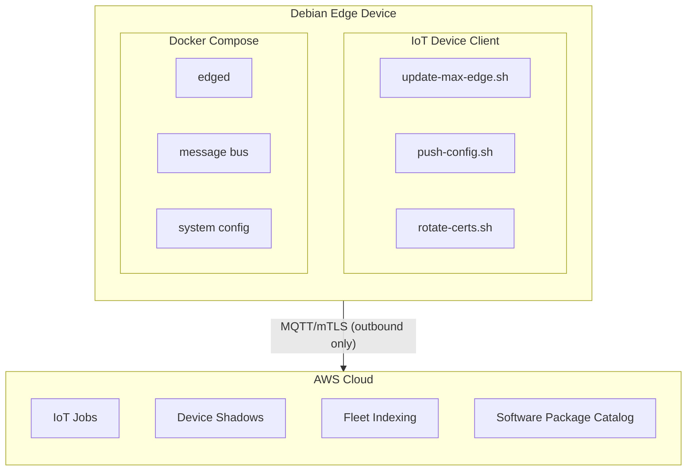
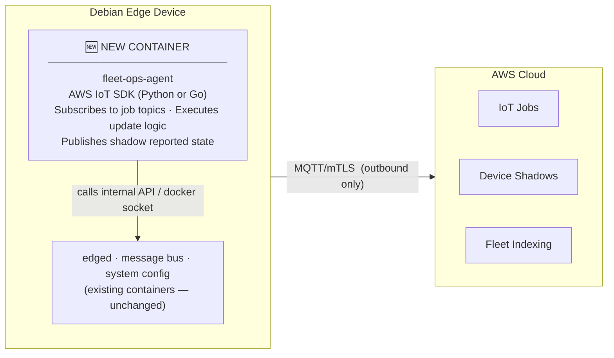

# NOV Max Edge — IoT Day-2 Fleet Operations: Stack Analysis

<strong>Prepared by:</strong> Walt Mayfield, Senior Solutions Architect, AWS Energy &nbsp;|&nbsp;
<strong>Date:</strong> 2026-06-03 &nbsp;|&nbsp;
<strong>For:</strong> Brady Joslin, NOV

---

## Current Architecture (as-is)

**What works today:**
- Outbound-only mTLS security posture — no inbound ports, no IP allowlisting
- `edged` connects to Edge Manager for single-device control-plane operations
- Docker Compose orchestrates the three-container application stack

**What's painful today:**
- No fleet-level targeting — batch tool operates one device at a time
- No desired/reported state — no way to query which devices are on which version
- No staged rollout or abort criteria — a bad update touches every device before you can stop it
- No offline queueing — device must be reachable at the moment of operation
- Rollback is manual

---

## Current State vs. Option Comparison

> Dimensions drawn from Brady's workshop request (2026-05-13). **Current state** = Edge Manager + home-grown batch tool + Bash scripts.

- **Option A — IoT Jobs + Device Client:** A pre-built AWS binary runs as a systemd service alongside your existing Docker Compose stack and handles all MQTT/job communication, so NOV only writes the Day-2 handler scripts.
- **Option B — IoT Jobs + Custom Container:** NOV builds and owns a dedicated `fleet-ops-agent` container that plugs into the existing Compose stack and speaks directly to the AWS IoT SDK — more control, more code to own.
- **Option C — Greengrass V2:** A full AWS-managed runtime that treats each application as a versioned component with lifecycle hooks and built-in OTA — the most capable option but also the largest deployment footprint.

| Dimension | Current State | Option A: IoT Jobs + Device Client ⭐ | Option B: IoT Jobs + Custom Container | Option C: Greengrass V2 |
|-----------|--------------|---------------------------------------|---------------------------------------|------------------------|
| **Fleet / cohort targeting** | ❌ One device at a time | ✅ [Dynamic Thing Groups](https://docs.aws.amazon.com/iot/latest/developerguide/dynamic-thing-groups.html) by attribute, version, or health | ✅ Same Thing Groups model | ✅ Deployment groups |
| **Desired / reported state + drift detection** | ❌ No shadow concept | ✅ [Named Device Shadows](https://docs.aws.amazon.com/iot/latest/developerguide/iot-device-shadows.html); Fleet Indexing surfaces version drift | ✅ Same shadow model | ✅ Component desired state built in |
| **Outbound-only mTLS security** | ✅ MQTT/mTLS via `edged` | ✅ Same transport — no new inbound ports | ✅ Same | ✅ Same |
| **Staged rollout + abort criteria** | ❌ No native control | ✅ [IoT Jobs rollout config](https://docs.aws.amazon.com/iot/latest/developerguide/jobs-configurations-details.html): N devices/min, abort on failure threshold | ✅ Same IoT Jobs rollout config | ✅ Built-in deployment configuration |
| **Job retry + timeout** | ❌ Manual re-run | ✅ Configurable retry + timeout per IoT Job definition | ✅ Same | ✅ Built in |
| **Idempotency** | ⚠️ Ansible for Day-1; Bash scripts for Day-2 | ⚠️ Handler scripts must be written idempotently — NOV owns | ⚠️ Agent container logic must implement idempotency | ✅ GG component lifecycle handles it |
| **Rollback on failure** | ❌ Manual | ⚠️ NOV writes exit-code-triggered rollback inside each handler script | ⚠️ NOV writes rollback logic in fleet-ops agent | ⚠️ Requires explicit prior-version component rollback |
| **Per-device job status** | ⚠️ Batch tool tracks status; limited fidelity | ✅ `IN_PROGRESS` / `SUCCEEDED` / `FAILED` / `TIMED_OUT` per device via [IoT Jobs](https://docs.aws.amazon.com/iot/latest/developerguide/iot-jobs.html) | ✅ Same | ✅ Per-device deployment status |
| **Fleet-wide version / health visibility** | ❌ No fleet query capability | ✅ [Fleet Indexing](https://docs.aws.amazon.com/iot/latest/developerguide/iot-indexing.html) + [Software Package Catalog](https://docs.aws.amazon.com/iot/latest/developerguide/software-package-catalog.html) | ✅ Same Fleet Indexing | ✅ Via IoT + GG deployment status |
| **Offline device handling** | ❌ Device must be reachable at time of operation | ✅ Jobs queue server-side; delivered on reconnect | ✅ Same IoT Jobs behavior | ✅ Same |
| **On-device resource overhead** | ✅ Low — existing stack only | ✅ Low — small C++ binary runs alongside existing stack | ✅ Low — one additional container in Compose | ⚠️ Higher — Greengrass nucleus adds CPU/memory overhead |
| **Fits existing Docker Compose stack** | ✅ Runs today | ✅ Device Client runs as `systemd` service alongside Compose — no changes | ✅ New container added to existing Compose stack | ❌ Requires rearchitecting `edged` + containers as GG components |
| **Human approval gate** (future state) | ❌ None | ⚠️ Custom build — Step Functions + manual approval task | ⚠️ Same — requires custom orchestration | ❌ No native concept |
| **Break-glass SSH access** | ⚠️ Via `edged` control plane | ✅ [Secure Tunneling](https://docs.aws.amazon.com/iot/latest/developerguide/secure-tunneling.html) built into Device Client — no inbound port | ❌ Not included; requires separate solution | ⚠️ Secure Tunneling available but not bundled |
| **NOV build investment** | — | **Low** — shell handler scripts per operation type | **Medium** — full IoT SDK agent in Go/Python | **High** — rearchitect entire edge stack |

---

## The Core Question

> "Can AWS IoT Core technologies provide a better operating model for Day-2 fleet operations while preserving our outbound-only, mTLS-based industrial edge security posture?"

**Short answer: Yes.** IoT Jobs uses a pull/polling model over the same MQTT/mTLS connection NOV already has — no new inbound ports, no IP changes, no firewall modifications. The question is *which stack depth* makes sense given the existing `edged` + Docker Compose architecture.

Below are three viable options, a mental model for each, and a gap analysis table.

---

## Recommended Stack Options

### Option A — IoT Jobs + AWS IoT Device Client ⭐ Recommended for Workshop

**Mental model: "Add a co-pilot system service that handles fleet coordination, while your existing stack flies the plane."**

[AWS IoT Device Client](https://github.com/awslabs/aws-iot-device-client) is a compiled C++ binary that runs as a `systemd` service *alongside* the Docker Compose stack. It handles all MQTT handshaking with AWS IoT Jobs, Device Shadows, Fleet Provisioning, and Secure Tunneling. NOV writes Day-2 logic as ordinary shell scripts (or Python) dropped into a "job handler extensions" folder — the Device Client finds and executes them when a job arrives and reports SUCCESS/FAILURE back to AWS based on exit code.

**What AWS provides:**
- Job polling, queueing for offline devices, rollout rate limiting, abort-on-failure-threshold, timeout, retry — all built in
- Named [Device Shadows](https://docs.aws.amazon.com/iot/latest/developerguide/iot-device-shadows.html) for desired/reported state per domain (app version, config, health)
- [Fleet Indexing](https://docs.aws.amazon.com/iot/latest/developerguide/iot-indexing.html) + [Dynamic Thing Groups](https://docs.aws.amazon.com/iot/latest/developerguide/dynamic-thing-groups.html) for automatic cohort segmentation
- [Software Package Catalog](https://docs.aws.amazon.com/iot/latest/developerguide/software-package-catalog.html) for version-aware targeting and distribution visibility
- [Secure Tunneling](https://docs.aws.amazon.com/iot/latest/developerguide/secure-tunneling.html) (in the same Device Client binary) for break-glass SSH with no inbound port

**What NOV writes:**
- Job handler scripts for each update type (Max Edge app update, config push, cert rotation)
- Shadow update logic in handlers (report back new version after successful update)
- Rollback logic inside each handler script (keep prior compose file, revert on health check failure)

**Key gotcha — dual MQTT connection:** The Device Client establishes a *second* MQTT connection to IoT Core (separate from `edged`'s connection). Each connection needs a unique client ID. Configure the Device Client with `{thingName}-dc` suffix to avoid collisions.

**Best for:** NOV's near-term workshop goal — minimal changes to existing stack, fastest path to demonstrating fleet-level job execution and shadow state.

---

### Option B — IoT Jobs + Custom Shadow Container (Docker-Native)

**Mental model: "Add a dedicated 'fleet ops' container to your existing Compose stack that speaks IoT natively."**

Instead of a separate system service, NOV adds a fourth container to the Docker Compose stack. This container owns all IoT SDK communication — subscribing to job topics, executing update logic by calling other containers (e.g., via `docker socket` or an internal API), and publishing shadow updates.

**What NOV writes:**
- The `fleet-ops-agent` container (using [AWS IoT SDK for Python](https://github.com/aws/aws-iot-device-sdk-python-v2) or Go)
- Shadow subscription and delta-handling logic
- Inter-container communication with `system config` to apply changes

**Trade-offs vs. Option A:**

| Dimension | Option A (Device Client) | Option B (Custom Container) |
|-----------|--------------------------|------------------------------|
| On-device code NOV owns | Just shell scripts | Full agent logic |
| Deployment model | Fits their existing systemd pattern | Fits their Docker-first preference |
| AWS SDK updates | NOV redeploys new Device Client binary (e.g., via IoT Jobs) | NOV bumps SDK version in Dockerfile and redeploys container |
| Time to first demo | Faster (Device Client is pre-built) | Slower (build and test agent) |
| Long-term flexibility | Less (C++ extension model) | More (full SDK access) |
| Reconnect storm risk | Managed by Device Client | Must implement backoff yourself |

**Best for:** Teams that want everything containerized and are comfortable owning the SDK integration. Good longer-term architecture if NOV wants to tightly integrate the agent with `system config`'s API.

---

### Option C — Greengrass V2 with Component Model (Not Recommended Here)

**Mental model: "Replace your Docker Compose orchestration with Greengrass as the edge application platform."**

Greengrass V2 manages software *components* (versioned, with dependency graphs and lifecycle hooks). It natively integrates with IoT Jobs for component deployments and has built-in shadow and stream manager support.

**Why this is not the right fit for NOV right now:**
- The team previously evaluated Greengrass V2 and found the component model problematic for the Go-based components in the existing stack
- Adopting Greengrass V2 components would require rearchitecting the existing 3-container stack, not just adding Day-2 operations on top
- GG V2 is the right answer if NOV later needs ML inference at the edge, local pub/sub between components, or component lifecycle management — but that's a separate decision from Day-2 ops

**Only revisit if:** NOV decides to rebuild Max Edge around a GG component model. Keep in the back pocket for the longer-term roadmap conversation.

---

## Recommended Shadow Document Design

Use **named shadows** (not classic) from the start — once you have more than one state domain, named shadows are the right pattern and cannot be easily migrated later.

Recommended three-shadow layout per device:

| Shadow Name | Owned By | Contains |
|-------------|----------|----------|
| `app-deployment` | Cloud (desired) + Device (reported) | Compose version, container image tags, deploy status |
| `device-config` | Cloud (desired) + Device (reported) | Config version, telemetry interval, feature flags |
| `device-health` | Device (reported only) | CPU/memory/disk %, container count, uptime, last heartbeat |

**Fleet Indexing query examples this enables:**
- `shadow.name.app-deployment.reported.compose_version:2.3.* AND connectivity.connected:true` → all online devices on a specific version branch
- `NOT shadow.name.app-deployment.desired.compose_version:shadow.name.app-deployment.reported.compose_version` → devices not yet at desired version (drift detection)

---

## Customer Evidence by Option

Published case studies skew heavily toward Greengrass V2 — that's where AWS has invested in customer storytelling. The absence of Device Client case studies reflects a gap in AWS marketing, not a gap in customer adoption.

### Option A — IoT Jobs + Device Client: Limited public evidence, strong adoption signal

No published industrial case study explicitly names AWS IoT Device Client as the production fleet agent. What does exist:

- **[Build a PoC in under 3 hours with the AWS IoT Device Client](https://aws.amazon.com/blogs/iot/build-a-proof-of-concept-iot-solution-in-under-3-hours-with-the-aws-iot-device-client/)** — AWS IoT Blog walkthrough of Device Client + Jobs + Fleet Indexing end-to-end. Technical reference, not a customer story.
- **[Schedule remote operations using IoT Device Management Jobs](https://aws.amazon.com/blogs/iot/schedule-remote-operations-using-aws-iot-device-management-jobs/)** — AWS blog demonstrating Device Client + Jobs scheduling with managed job templates.
- **[aws-samples/iot-jobs-for-rapid-large-scale-device-updates](https://github.com/aws-samples/iot-jobs-for-rapid-large-scale-device-updates)** — AWS reference implementation for large-scale OTA with Jobs.
- **[Hero MotoCorp](https://aws.amazon.com/solutions/case-studies/hero-motocorp-case-study/)** — Closest published adjacent: connected vehicle platform on AWS IoT delivering remote diagnostics and OTA updates at fleet scale (automotive, not IIoT, but same Jobs + fleet management pattern).
- **AWS positioning:** Device Client is designed as the right starting point for teams implementing IoT Jobs, Shadows, and Secure Tunneling on Linux without a Greengrass dependency. The intended path is PoC → production — the absence of a published case study reflects a marketing gap, not a production readiness gap.

**Bottom line for NOV:** Device Client is the right starting point for the workshop, and the pattern is sound for production at NOV's scale. Your AWS account team can provide NDA-protected customer references if needed before committing to production.

### Option B — Custom SDK container: No published references

No published AWS case study documents an industrial customer running a custom IoT SDK container in Docker Compose as their fleet management agent. This pattern is almost certainly common in practice — customers who wrap the SDK in their own agent often don't write it up. **[WirelessCar](https://aws.amazon.com/solutions/case-studies/wirelesscar-case-study/)** uses IoT Core for connected vehicle fleet management and likely uses a custom integration, but the architecture isn't documented publicly.

### Option C — Greengrass V2: Strong published evidence, all industrial/energy

This is the best-documented pattern for IIoT at scale, with several directly relevant customer references:

| Customer | Vertical | What They Did |
|----------|----------|---------------|
| **[Moeve (fmr. Cepsa)](https://aws.amazon.com/blogs/industries/transforming-the-operations-of-moeves-energy-parks-with-a-data-gathering-digital-plant-solution/)** | Oil & gas / energy | Data Gathering Digital Plant on Greengrass V2 — collects and structures operational data from sensors, IoT devices, and manufacturing systems at Energy Parks |
| **[Siemens Energy](https://aws.amazon.com/solutions/case-studies/siemens-energy-video-case-study/)** | Industrial manufacturing | Industrial IoT platform on AWS IoT; reduced manual data collection time and OT asset maintenance efforts |
| **[ST Engineering](https://aws.amazon.com/solutions/case-studies/st-engineering-case-study/)** | Industrial / defense | Explicitly adopted AWS IoT Greengrass for building, deploying, and managing device software |
| **[MOIA (VW subsidiary)](https://aws.amazon.com/solutions/case-studies/moia-case-study/)** | Electric ridesharing fleet | Greengrass + Lambda@Edge in-vehicle to collect data across the fleet |
| **[ZF Group](https://aws.amazon.com/solutions/case-studies/zf-group-case-study/)** | Automotive / fleet | 300,000+ connected devices; intelligent IoT platform for fleet orchestration (trucks/trailers) |

**The catch for NOV:** Every one of these customers *built around* Greengrass from the start, or runs it for telemetry and data collection (not Day-2 fleet ops). None of them had NOV's constraint: an existing Docker Compose stack with Go-based components the team already ruled out running as GG components. The published evidence supports Greengrass as a strong *greenfield* choice — it does not change the recommendation for NOV's *brownfield* situation.

---

## Gap Analysis: AWS Native vs. NOV Builds vs. Stays in Edge Manager

| Capability | AWS Provides Natively | NOV Builds on Top | Stays in Edge Manager |
|------------|----------------------|-------------------|-----------------------|
| Job dispatch, queueing for offline devices | ✅ IoT Jobs | | |
| Rollout rate limiting (N devices/min) | ✅ IoT Jobs rollout config | | |
| Abort on failure threshold | ✅ IoT Jobs abort criteria | | |
| Job retry on timeout/failure | ✅ IoT Jobs retry config | | |
| Job scheduling (maintenance windows) | ✅ IoT Jobs scheduling | | |
| Desired/reported state reconciliation | ✅ Device Shadows (delta topics) | | |
| Fleet query (who's on version X?) | ✅ Fleet Indexing `SearchIndex` | | |
| Dynamic cohort targeting | ✅ Dynamic Thing Groups | | |
| Software version distribution visibility | ✅ Software Package Catalog + Fleet Indexing | | |
| Break-glass SSH (no inbound port) | ✅ Secure Tunneling (in Device Client) | | |
| On-device job execution logic | | ✅ Shell scripts / handler container | |
| App-layer validation (did it actually start?) | | ✅ Health check in handler script | |
| Rollback trigger logic | | ✅ Exit-code rollback in handler | |
| Multi-stage deployment orchestration (canary → staged → full) | Partial (exponential rollout helps) | ✅ Orchestrate multiple jobs in sequence | |
| Cross-job dependency ("update A then B") | | ✅ Orchestration lambda or step function | |
| Business-specific retry policies (e.g., only during maintenance window) | Partial (scheduling helps) | ✅ Custom abort + reschedule logic | |
| Version comparison queries (e.g., version < 2.0) | ⚠️ Not supported on `$package` shadow — exact match only | ✅ Use thing attributes with semver encoded as integer fields | |
| Compliance/audit trail dashboard | Partial (CloudWatch Fleet Metrics gives aggregate) | ✅ Custom reporting layer | |
| CI/CD integration (build → artifact → job creation) | | ✅ CodePipeline or GitHub Actions glue | |
| Per-device operation (one-off, time-sensitive) | ✅ [IoT Commands](https://docs.aws.amazon.com/iot/latest/developerguide/iot-remote-command.html) (newer service) | | |
| Single-device connection management | | | ✅ Edge Manager (existing control plane) |
| Hardware-level I/O, PLC interface | | | ✅ `edged` + Docker Compose stack |
| Operator UX / fleet dashboard | Partial (IoT Device Management console) | | ✅ Edge Manager (long-term build target) |

---

## Key Gotchas to Surface in the Workshop

1. **Fleet Hub EOL (Oct 2025)** — Fleet Hub was discontinued. Use the [IoT Device Management console](https://docs.aws.amazon.com/iot/latest/developerguide/iot-jobs.html) directly for fleet operations UI. Do not build integrations against Fleet Hub APIs.

2. **Dual MQTT connection (Option A)** — Device Client creates a second connection to IoT Core alongside `edged`. Must use distinct client IDs (`{thingName}-dc`).

3. **Max 10–15 pending jobs per device** — if more than 15 jobs are queued for a device, new jobs are rejected. Design job batching accordingly; don't fan out more than 10–15 concurrent operations to the same device.

4. **`$package` shadow — no version range queries** — Fleet Indexing does not support `<` or `>` operators on the reserved `$package` named shadow version key. Workaround: store a version integer in a thing *attribute* (`semver_int: 20401`) and use range queries there.

5. **Dynamic Thing Groups are eventually consistent** — group membership is evaluated asynchronously. Newly registered devices may take seconds to minutes to appear in a group after state changes. Don't rely on synchronous group membership for safety-critical sequencing.

6. **Shadow size limit: 8 KB per named shadow** — the three-shadow design above stays well within this. Avoid putting high-frequency telemetry in shadows; that goes via MQTT rules to Kinesis/Timestream.

7. **Dynamic group limit: ~100 per account** — at 1,000–2,000 devices this is fine. At the scale of hundreds of customers/sites, group design needs planning to stay within quota.

---

## Existing AWS Workshops NOV Could Use

Rather than building a custom workshop from scratch, we can base the NOV session on existing AWS Workshop Studio content — customizing the job handler scenarios to match NOV's actual update operations.

| Workshop | Duration | Device Client? | IoT Jobs? | Fleet Day-2 focus | Best fit for NOV |
|----------|----------|---------------|-----------|-------------------|-----------------|
| **[Get Started with AWS IoT](https://catalog.us-east-1.prod.workshops.aws/workshops/6d30487a-48e1-4631-b6bc-5602582800b5/en-US/)** | 3 hrs · L200–300 | ✅ Yes — core of the workshop | ✅ OTA remote operations, managed templates, and custom job handlers | Partial — PoC focus, not fleet-scale Day-2 | **Best base for the workshop.** Module 5 (IoT Jobs with managed template) + Module 8.1 (Custom Jobs) maps directly to NOV's handler scripts. Use NOV's actual update scenarios in place of the generic job. |
| **[Manage a Connected AWS IoT Device Fleet](https://catalog.us-east-1.prod.workshops.aws/workshops/25ae7a2f-432b-4a06-9357-6c9b81bc192d)** | Half-day · L200 | Not explicit | ✅ Fleet firmware update + rollout monitoring | ✅ Yes — Dynamic Thing Groups, Fleet Metrics, CloudWatch dashboards, Jobs-based remediation | **Best for the fleet operations half** of Brady's ask — staging, abort, fleet visibility. Combine with the first workshop for a full-day session. |
| **[AWS IoT Zero Trust Workshop](https://catalog.us-east-1.prod.workshops.aws/workshops/1d50f8ef-5030-42c9-9488-a2187472c9e6)** | 3 hrs · L300 | ✅ Yes | ✅ Yes | ✅ Day-2 ops including patching, anomaly detection, incident response | Good add-on if NOV wants to tie Device Defender into the security posture conversation (outbound-only model). |
| **[AWS IoT Device Management (Builder Center)](https://catalog.workshops.aws/workshops/40b80218-bf1d-45d6-b8bb-022f6d316a52)** | 4 hrs · L200 | Not explicit | ✅ OTA updates + Software Package Catalog | ✅ Fleet Indexing, Dynamic Thing Groups, IoT Commands, CloudWatch monitoring | Good alternative if Brady wants to cover Software Package Catalog integration in the same session. |

**Recommended approach for the NOV workshop:**

1. Use **"Get Started with AWS IoT"** as the skeleton — it's the only workshop that explicitly combines Device Client + Jobs + custom handler scripts end-to-end on a Linux device.
2. Swap the generic job scenarios for NOV-specific ones: Max Edge app update and config push.
3. Pull in the **Dynamic Thing Groups + staged rollout** module from "Manage a Connected Fleet" for the fleet operations half.
4. Deliver via Workshop Studio (Jeff can provision temporary accounts) — no need for NOV to use their own AWS environment for the lab.

---

## Suggested Workshop Agenda (4 hours, Option A)

| Block | Duration | Content |
|-------|----------|---------|
| Setup | 30 min | Register 3 lab Things, install Device Client as systemd service, verify MQTT connectivity |
| Module 1 | 45 min | First job: push a config update to a single device via IoT Jobs; observe job status lifecycle |
| Module 2 | 45 min | Name three shadows per device; device agent reports app version and health; query with Fleet Indexing |
| Module 3 | 60 min | Create Dynamic Thing Group by version; run a staged job (rollout rate + abort threshold) across 3 devices; simulate one failure |
| Debrief | 60 min | Gap list review; reference architecture diagram; PoC plan; what stays in Edge Manager |

---

## Recommended PoC Scope (Post-Workshop)

1. **Phase 1 (2–4 weeks):** 10 lab devices. IoT Jobs + Device Client. Two handler scripts: Max Edge app update + config push. Named shadows for app version + health. Staged rollout with abort criteria.
2. **Phase 2 (4–6 weeks):** Dynamic Thing Groups by customer/site attributes. Software Package Catalog integration. Fleet Indexing dashboard in CloudWatch. CI/CD glue: GitHub Actions → S3 artifact → create IoT Job.
3. **Phase 3:** Evaluate Option B (custom shadow container) if team prefers Docker-native long-term.

---

## A Note on the Telemetry Data Plane

This document focuses on the **control plane** — how you push jobs, desired state, and configuration down to devices. IoT Core is the right tool for that problem.

The **telemetry data plane** — moving high-frequency sensor data from edge to cloud — is a separate architectural question with different trade-offs. At the scale NOV is heading toward (1,000+ devices, growing 2× annually), a few signals suggest that IoT Core's MQTT ingestion path alone may not be the long-term answer for telemetry:

- **High-throughput, high-frequency sensors:** IoT Core is optimized for control and event messaging, not streaming hundreds of thousands of messages per second with durable, replayable delivery guarantees.
- **Intermittent WAN connectivity:** Rigs and frac vans on satellite or LTE links experience frequent disconnects. A durable edge-side log (e.g., [Redpanda](https://www.redpanda.com/) or [Apache Kafka](https://kafka.apache.org/) at the edge) can buffer and replay from the last committed offset when connectivity restores — no data loss, no application-level retry logic required.
- **Configurable sources and sinks:** As the number of data consumers grows (real-time dashboards, ML pipelines, historian replay, third-party integrations), a streaming backbone with independent consumer groups scales more cleanly than point-to-point MQTT fan-out.

If NOV reaches a point where telemetry volume, WAN reliability, or multi-consumer data distribution becomes a constraint, an edge streaming architecture — a local durable log at the edge relaying into a cloud streaming service like [MSK](https://aws.amazon.com/msk/) — is worth a dedicated conversation. That is a separate engagement from Day-2 fleet ops, but the foundation being built here (device identity, shadows, fleet grouping) is directly complementary.

---

## Reference Links

- [AWS IoT Jobs developer guide](https://docs.aws.amazon.com/iot/latest/developerguide/iot-jobs.html)
- [AWS IoT Device Client (GitHub)](https://github.com/awslabs/aws-iot-device-client)
- [Device Shadows — named vs. classic](https://docs.aws.amazon.com/iot/latest/developerguide/iot-device-shadows.html)
- [Fleet Indexing — query syntax](https://docs.aws.amazon.com/iot/latest/developerguide/query-syntax.html)
- [Dynamic Thing Groups](https://docs.aws.amazon.com/iot/latest/developerguide/dynamic-thing-groups.html)
- [Software Package Catalog](https://docs.aws.amazon.com/iot/latest/developerguide/software-package-catalog.html)
- [IoT Commands (single-device operations)](https://docs.aws.amazon.com/iot/latest/developerguide/iot-remote-command.html)
- Prefer Device Client for Jobs/Shadows/Tunneling on Linux without GG dependency
- [IoT Well-Architected Lens](https://docs.aws.amazon.com/wellarchitected/latest/iot-lens/iot-lens.html)
