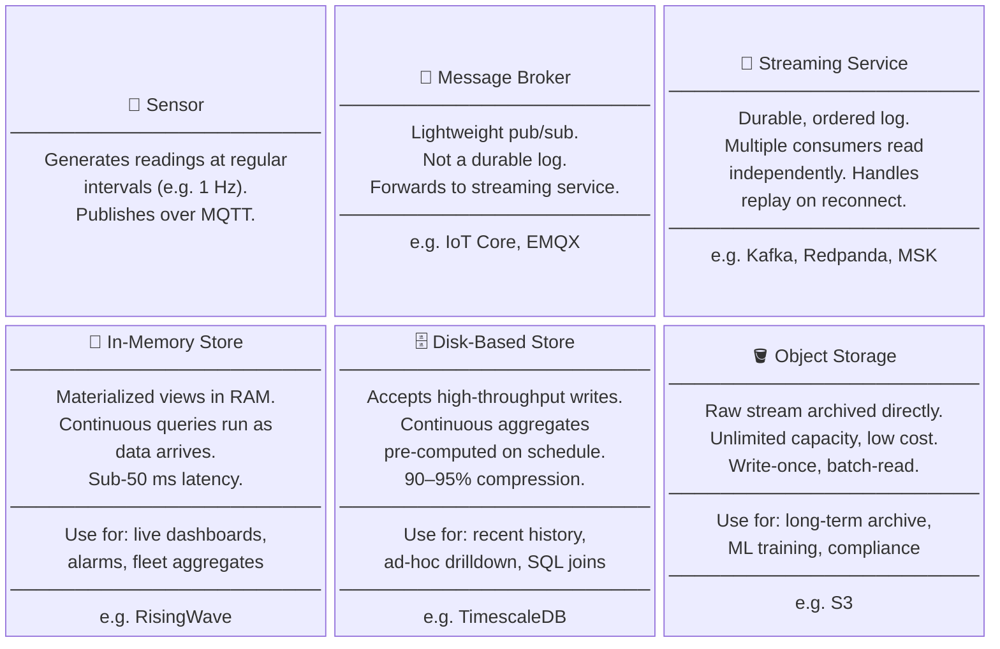
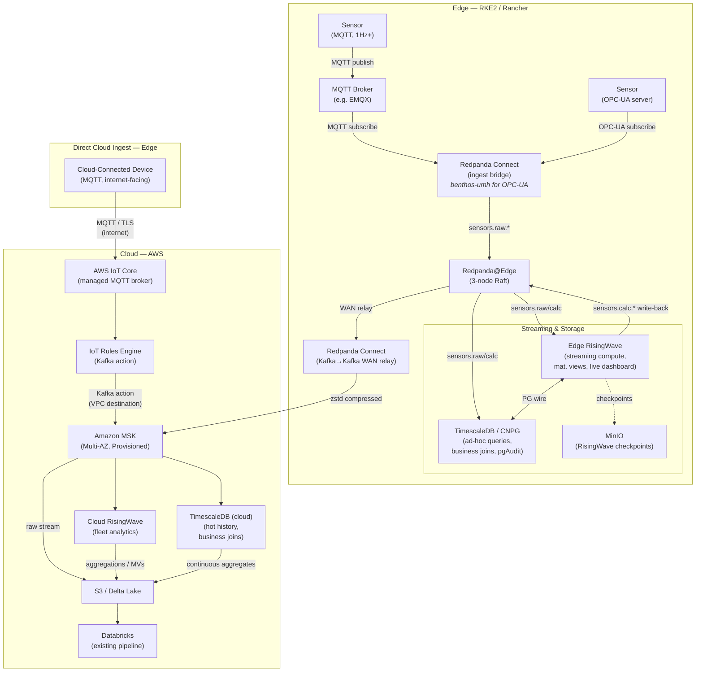
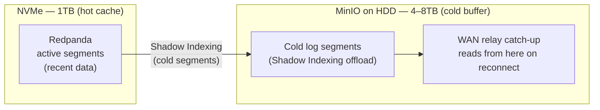
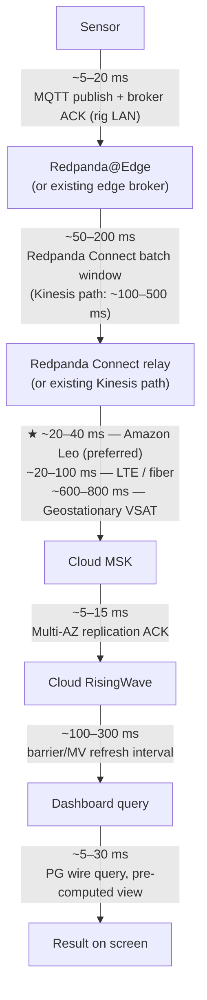

# Real-Time Edge-to-Cloud Pipeline Architecture

This proposal is **additive and modular**. The edge deployment architecture (Redpanda, RisingWave, TimescaleDB on RKE2) is independent of the cloud piece — NOV can plug in whatever edge stack they have today to the Cloud MSK → RisingWave leg, or adopt the full edge architecture. The existing Kinesis → Databricks → S3 pipeline continues unchanged.

---

## Conceptual Model

Before the implementation details, it helps to establish the underlying pattern. Every real-time sensor pipeline is a variation of the same four-layer model:



The rest of this document maps real AWS and open-source components onto each box. The pattern stays the same whether the pipeline runs on a rig at the edge or entirely in the cloud.

---

## Architecture



### Component Roles

| Component | Role | HA Model |
|---|---|---|
| **AWS IoT Core** | Managed MQTT broker for cloud-connected or internet-facing devices; no edge infrastructure required | AWS-managed, Multi-AZ; [service SLA 99.9%](https://aws.amazon.com/iot-core/sla/) |
| **IoT Rules Engine (Kafka action)** | Native rules-engine action that routes IoT messages directly to MSK via a VPC destination; no Lambda or Kinesis hop needed | AWS-managed; runs inline with IoT Core |
| Redpanda@Edge | Durable stream buffer; offline replay; single messaging hub | 3-node Raft cluster — tolerates 1 node failure transparently |
| Redpanda Connect (ingest) | Protocol bridge into Redpanda. MQTT path: subscribes to the edge MQTT broker. OPC-UA path: connects directly to OPC-UA servers on the rig floor using [benthos-umh](https://docs.umh.app/benthos-umh/input/opc-ua-input), a community fork of Redpanda Connect purpose-built for industrial IoT. | RKE2 Deployment with replica=2 |
| Redpanda Connect (relay) | Edge Redpanda → Cloud MSK; handles WAN intermittency | RKE2 Deployment; pauses/resumes from committed offset on reconnect |
| Edge RisingWave | Streaming compute; materialized views; live dashboard serving; writes calculated values back to Redpanda | RKE2 StatefulSet, multi-node; checkpoints to MinIO |
| TimescaleDB (CNPG) | Durable time-series store; ad-hoc queries joining sensor data + business data; pgAudit | 1 primary + 2 synchronous replicas via CloudNativePG; WAL archived to S3 when connected |
| Cloud MSK | Cloud-side stream buffer; raw stream written directly to S3 for long-term archival | AWS-managed; Multi-AZ |
| Cloud RisingWave | Cloud analytics; aggregations and materialized views over full fleet history; writes aggregation results to S3 | AWS-managed or self-hosted on EKS |
| Cloud TimescaleDB | Hot-tier history (days–weeks); ad-hoc SQL over raw + calculated sensor data; joins with business data (equipment, maintenance, well records); continuous aggregates written to S3 | RDS for PostgreSQL + TimescaleDB extension, Multi-AZ |
| S3 | Long-term storage; receives raw stream from MSK, aggregation results from RisingWave, and continuous aggregates from TimescaleDB; feeds existing Databricks pipeline | Existing — no change |

---

## Tool Selection Guide

Three query tiers serve different access patterns. Choosing the wrong tier costs latency (Databricks for live queries) or unnecessary complexity (RisingWave holding raw row history it isn't designed for).

| Query Pattern | Right Tier | Why |
|---|---|---|
| Live dashboard — current sensor reading, sub-100 ms required | **Cloud RisingWave** | In-memory Materialized View (MV); <50 ms query; no disk access |
| Rolling 60 s window aggregate, ultra-low latency required | **Cloud RisingWave** | MV refreshes on every stream barrier; no row scan |
| Fleet-wide aggregate — current avg WOB across 100 rigs | **Cloud RisingWave** | MV spans all rigs; returns instantly |
| Last 7/30/180-day trend chart (hourly or daily buckets) | **Cloud TimescaleDB** | Continuous aggregates precompute the buckets on write; dashboard query scans tiny aggregate table, not raw rows |
| "What happened on this well in the last 48 hours?" (raw drill-down) | **Cloud TimescaleDB** | Hypertable chunk pruning; targeted single-sensor scan is fast even on raw rows |
| "Rigs with torque spikes + open maintenance tickets this week" | **Cloud TimescaleDB** | Join sensor hypertable with business tables in one Postgres query |
| Anomaly history for a single equipment ID since mid-2024 | **Databricks (Delta Lake)** | Long-term cold store; Spark for large scans |
| ML training — 12 months of raw sensor history | **Databricks (Delta Lake)** | Full dataset; batch-optimized; existing pipeline |

### RisingWave vs. TimescaleDB for dashboards

No dashboard renders raw 1 Hz rows — at 1,000 sensors × 7 days, that's ~600 million rows that a visualization layer will downsample anyway. The real question is where the aggregation happens and how much latency is acceptable.

**Build the materialized view in RisingWave** when ultra-low latency is the priority. The view stays in memory and returns in <50 ms. The cost is maintenance: each view requires streaming SQL with watermark definitions, and every new dashboard panel is an engineering task. Memory footprint also scales with the number and complexity of views.

**Let TimescaleDB do continuous aggregates** when a small amount of latency is acceptable and lower maintenance is worth more. A continuous aggregate is a simple `CREATE MATERIALIZED VIEW ... WITH (timescaledb.continuous)` plus a refresh policy — no streaming SQL, no watermarks. TimescaleDB refreshes the aggregate buckets on a schedule (e.g., every 30 seconds) rather than on every stream event, which means freshness lags slightly but dashboard query latency is still well under 1 second. The memory footprint is minimal — TimescaleDB is a disk-based store and the aggregate tables are tiny.

In practice: **operational safety dashboards** (current WOB, pressure alarms, live driller panel) belong in RisingWave — latency matters and the view set is small and stable. **Historical trend dashboards** (last 7/30/180 days) belong in TimescaleDB — the query pattern is aggregation over time, the view set changes as new dashboard panels are added, and sub-100 ms isn't required.

**Retention by tier:**

| Tier | Retention | Freshness | Notes |
|---|---|---|---|
| Cloud RisingWave | No raw row storage — materialized views only | ~100–300 ms from MSK | Memory footprint is bounded by MV definitions, not data age; not a historical store |
| Cloud TimescaleDB | Configurable; recommend 30–90 days | Seconds (continuous write) | Compression after 7-day chunks — 90–95% typical on regular sensor streams; continuous aggregates make historical dashboard queries fast without raw row scans |
| S3 / Delta Lake → Databricks | Indefinite | Minutes–hours (existing pipeline) | Unchanged — long-term record of truth |

---

## Data Flow Detail

### 1. Ingest (sensor → Redpanda)
Sensors publish MQTT messages at 1Hz+. **Redpanda Connect** (RKE2 deployment) subscribes via MQTT and produces batched messages to Redpanda topic `sensors.raw.*`. No separate MQTT broker needed — Redpanda Connect handles protocol translation natively.

### 2. Edge streaming compute (Redpanda → Edge RisingWave)
Edge RisingWave consumes from `sensors.raw.*` and maintains materialized views for live dashboard queries. Typical views:
- Latest reading per sensor (point-in-time)
- Rolling 60-second aggregates (min/max/avg per sensor)
- Anomaly flags (pressure delta > threshold)

Calculated values (e.g., derived RPM, pressure differentials) are written back to Redpanda topic `sensors.calc.*` via RisingWave's native Kafka sink. This keeps RisingWave stateless — on restart, it replays from Redpanda and rebuilds materialized views.

### 3. Durable storage (Redpanda → TimescaleDB)
A second Redpanda Connect pipeline bulk-inserts from both `sensors.raw.*` and `sensors.calc.*` into TimescaleDB hypertables. Batching configuration (e.g., 1000 messages or 500ms, whichever comes first) keeps WAL volume manageable at 30K writes/second.

TimescaleDB is **off the dashboard hot path** — the live dashboard queries RisingWave via its PostgreSQL wire protocol. TimescaleDB serves ad-hoc queries that need to join time-series data with business data (equipment metadata, well records, maintenance history).

pgAudit is enabled on TimescaleDB — every read and write is logged for compliance.

### 4. Cloud relay (Redpanda → Cloud MSK)
A third Redpanda Connect pipeline reads all topics from edge Redpanda and writes to Cloud MSK using the Kafka→Kafka connector with **zstd compression** enabled.

- **Compression ratio:** zstd on repetitive numerical time-series typically achieves 4:1–6:1
- **Estimated WAN bandwidth:** ~250–375 KB/s uncompressed → ~75–95 KB/s with zstd — well within Amazon Leo's available throughput
- **Preferred WAN path:** Amazon Leo (LEO satellite) — ~20–40 ms RTT. Geostationary satellite (600–800 ms RTT) and LTE (20–100 ms) are supported as fallbacks; the relay layer is link-agnostic.
- **Intermittency handling:** When the WAN link drops, Redpanda Connect pauses and unconsumed messages accumulate in edge Redpanda (bounded by configured retention). On reconnect, relay resumes from last committed offset — no data loss, no manual intervention.

### 5. Raw archival (MSK → S3)
A Kafka S3 connector (MSK Connect or Kafka Connect) writes the raw `sensors.raw.*` and `sensors.calc.*` streams directly from MSK into S3 as the primary long-term archive. This path is independent of RisingWave and TimescaleDB — raw data lands in S3 regardless of what either compute tier does downstream. The existing Databricks / Delta Lake pipeline reads from S3 and is unchanged.

### 5a. Cloud analytics (MSK → Cloud RisingWave → S3)
Cloud RisingWave consumes from MSK for fleet-wide analytics and aggregations. Aggregation results (materialized view outputs — e.g., fleet-wide hourly summaries, anomaly roll-ups) are written back to S3 alongside the raw archive. These are **transformed results**, not the raw stream — Databricks or downstream consumers can query them without re-running aggregations.

### 6. Cloud hot tier (MSK → Cloud TimescaleDB → S3)
A Redpanda Connect pipeline — mirroring the edge TimescaleDB consumer — bulk-inserts from `sensors.raw.*` and `sensors.calc.*` on MSK into a cloud TimescaleDB hypertable. Same batching configuration as the edge (1,000 messages or 500 ms, whichever comes first).

Cloud TimescaleDB is off the live dashboard path — RisingWave serves live queries. TimescaleDB serves ad-hoc queries that need recent raw data or joins against business tables that don't belong in a streaming compute layer. Hypertable compression is enabled after a 7-day chunk age, typically achieving 90–95% compression on regular sensor streams.

**Continuous aggregates** are the mechanism that makes historical dashboard queries fast at this scale. A `CREATE MATERIALIZED VIEW ... WITH (timescaledb.continuous)` plus a refresh policy (e.g., every 30 seconds) precomputes hourly or daily buckets on write. A "last 7 days" trend chart then scans a tiny aggregate table — not ~600 million raw rows — and returns in milliseconds. This is TimescaleDB's equivalent of RisingWave materialized views, applied to the historical tier rather than the live stream.

**Business joins** are the primary differentiator from RisingWave. A WellData developer can write a single Postgres query joining sensor history against equipment registry, maintenance work orders, or well records without a Spark job, a Delta Lake read, or any data movement. The hypertable and business tables live in the same Postgres instance. This tier effectively gives the application team a fast, familiar SQL interface to the last 30–90 days of data — a gap that currently sits between the live RisingWave views and the batch-latency Databricks pipeline.

**S3 output:** TimescaleDB's continuous aggregate tables (hourly/daily pre-computed buckets) are exported to S3 on a scheduled basis, making them available to Databricks and other consumers without raw row scans. This is distinct from the raw MSK → S3 path — what lands here is already aggregated and compressed, not the raw 1 Hz stream.

**Deployment:** RDS for PostgreSQL with the TimescaleDB extension, Multi-AZ for HA. Business tables can be replicated into the same instance from existing sources (RDS snapshots, DMS, or periodic loads) or live there natively if the application team chooses to consolidate.

---

## High Availability at the Edge

### Redpanda HA
- 3-node Raft cluster; `replication_factor=3` on all topics
- One broker pod per node — enforced by `podAntiAffinity` (`topologyKey: kubernetes.io/hostname`)
- `PodDisruptionBudget` ensures at least one broker available during node maintenance or rolling upgrade
- Tolerates 1 node failure with zero impact to producers or consumers
- Raft leader election on failure: ~2–5 seconds (vs Kafka/ZooKeeper: 30–60s)
- Managed entirely through Rancher/Helm — upgrades, rollbacks, and config changes follow the same path as every other RKE2 workload

### RisingWave HA
- Deployed as RKE2 StatefulSet across 3 nodes with `topologyKey: kubernetes.io/hostname` anti-affinity
- Checkpoints to MinIO (3-node, erasure-coded, co-located on RKE2 cluster)
- On node failure: remaining nodes continue serving; degraded capacity until replacement
- On full restart: replays from Redpanda committed offset and rebuilds materialized views

### TimescaleDB HA (CloudNativePG)
- 1 primary + 2 synchronous replicas (`synchronous_commit = remote_apply`)
- Zero data loss on primary failure; CNPG automatic failover in 5–10 seconds
- WAL archived to S3 when cloud connectivity is available (point-in-time recovery)

### RKE2 Control Plane HA
- 3 RKE2 server nodes with embedded etcd
- Control plane survives single node failure; workloads unaffected

### Failure Mode Summary

| Failure | Impact |
|---|---|
| 1 of 3 Redpanda nodes | Transparent — Raft re-elects, cluster continues |
| 1 of 3 RKE2 nodes | Redpanda broker pod rescheduled (PDB keeps quorum); RisingWave/TimescaleDB degrade gracefully; PDB prevents simultaneous loss of multiple Redpanda brokers |
| WAN link to cloud | Edge dashboard continues from local RisingWave + TimescaleDB; data buffered in Redpanda; auto-replays on reconnect |
| Edge RisingWave node | Dashboard degrades to remaining nodes; MinIO checkpoint used for recovery |
| TimescaleDB primary | CNPG auto-promotes replica in 5–10s; ad-hoc queries briefly unavailable |
| Full rig power loss (with UPS) | UPS triggers graceful shutdown; all ACK'd messages on NVMe survive; Redpanda replays WAL on restore; WAN relay resumes from last committed offset |
| Full rig power loss (without UPS) | Messages ACK'd before power cut are durable on NVMe and survive; any in-flight messages at the exact moment of cut may be lost (sub-second window); sensor data generated during the outage is not recorded |

---

## Security

NOV operates in a regulated O&G environment with physical access risk at the rig. Security posture must account for both network threats and insider/physical access.

### Encryption

| Layer | Mechanism |
|---|---|
| NVMe at rest | LUKS full-disk encryption or hardware-encrypted SSDs (self-encrypting drives) on all 3 nodes |
| MinIO at rest | Server-side encryption (SSE-S3 or SSE-KMS) for RisingWave checkpoints and audit log archives |
| In-transit (broker) | TLS between all Redpanda brokers (mTLS, cert-manager issued) |
| In-transit (clients) | mTLS for Redpanda Connect → Redpanda, RisingWave → Redpanda, TimescaleDB replication |
| WAN relay | TLS on Redpanda Connect → MSK (AWS-managed TLS) |

### Certificate Lifecycle

Rigs are intermittently connected — they cannot rely on a cloud CA being reachable for certificate renewal. Recommended approach:

- **cert-manager** manages certificate issuance and rotation within RKE2
- **Vault (or SPIFFE/SPIRE)** acts as the local CA, running on-cluster, issuing short-lived mTLS certs without cloud dependency
- Certificate rotation is handled in-cluster; cloud connectivity is not required for cert renewal

### Access Control

| Control | Mechanism |
|---|---|
| Redpanda SASL/SCRAM | SCRAM-SHA-512 for all client authentication (already in Redpanda Operator config) |
| Redpanda topic RBAC | Safety-critical topics (`sensors.alarms.*`) — read-only for all operator roles; write only from designated producers. Operators cannot purge. |
| RKE2 RBAC | Namespace-scoped roles; rig operators have no access to Redpanda broker pods or TimescaleDB primary |
| MinIO IAM | Per-application access keys; RisingWave and audit log pipelines use separate keys with scoped bucket permissions |

### Network Segmentation

Two physically (or VLAN) separated networks on the rig:

- **Sensor LAN** — MQTT devices only; no RKE2 management traffic
- **RKE2 cluster network** — Redpanda Connect, Redpanda, RisingWave, TimescaleDB, MinIO; no direct sensor access
- Redpanda Connect is the only process with a foot in both networks (sensor LAN inbound, cluster network outbound)

### Image Provenance

Physical access to rig hardware is a real threat vector. Container images should be signed with **Cosign/Sigstore** and verified by an RKE2 admission webhook before scheduling. This prevents tampered images from running even if someone with physical rig access replaces a node or injects a malicious update.

---

## Retention Policy & WAN Buffer Management

### The Buffer Exhaustion Problem

When the WAN link is down, Redpanda@Edge becomes the buffer. At 1,000 sensors × 1Hz × ~50 bytes, the raw stream is ~50 KB/s — manageable. But high-frequency sensors (vibration, acoustic) can push 50–100 MB/s, filling 1TB of NVMe in hours. An unmanaged buffer will eventually drop data silently.

### Solution: Redpanda Tiered Storage (Shadow Indexing)

Redpanda's **Tiered Storage** feature (Shadow Indexing) offloads cold log segments from NVMe to an S3-compatible object store — in this architecture, a dedicated MinIO instance backed by **HDD rather than NVMe**. This turns the 1TB NVMe into a hot cache while a larger, cheaper HDD-backed MinIO volume handles the full outage buffer.



This effectively gives **"infinite" edge buffering** bounded only by the HDD volume, not NVMe. An 8-hour WAN outage at 50 KB/s compressed (~22 GB) is trivially handled; even high-frequency acoustic data (100 MB/s = ~720 GB uncompressed over 2 hours) becomes manageable with zstd + a multi-TB HDD.

**Note:** Tiered Storage requires **Redpanda Enterprise**. This is already the recommended deployment tier for production; this feature should be an explicit line item in any Redpanda Enterprise agreement.

**Catch-up read latency:** When the WAN relay resumes after a long outage, it reads tiered segments from MinIO/HDD rather than NVMe. Throughput is lower (~200–400 MB/s HDD vs 3+ GB/s NVMe), but for the relay catch-up path this is acceptable — the relay is not on the dashboard hot path.

### Per-Topic Retention Tiers

| Topic | Priority | Retention Policy | Rationale |
|---|---|---|---|
| `sensors.alarms.*` | Critical | `retention.ms = -1` (indefinite) + replicated to cloud as dedicated Redpanda topic | Safety-critical; never drop |
| `sensors.raw.*` | High | `retention.bytes = 80%` of tiered storage capacity | Full-fidelity data; drop oldest if storage exhausted |
| `sensors.calc.*` | Medium | `retention.ms = 72h` | Derived values; can be recomputed from raw on recovery |
| `audit.timescaledb.*` | High | `retention.ms = -1` + cloud replication | Compliance; see Auditability section |
| `sensors.vibration.*` / `sensors.acoustic.*` | Low | `retention.ms = 4h` + aggressive zstd | High-volume; best-effort during extended outage |

### Buffer Alerts

- **80% NVMe utilization** — alert fires locally (Grafana, rig-local); triggers HDD offload review
- **WAN relay lag > 5 minutes** — alert fires; indicates accumulation rate is outpacing relay bandwidth
- **Tiered storage 80% full** — critical alert; operator action required (expand HDD or acknowledge data loss risk)

---

## Dashboard Delivery

The latency budget (sensor → RisingWave materialized view) is well-defined. This section covers the last mile: how that data reaches a user's screen.

### Protocol

**Grafana with sub-second polling** is the recommended approach for the initial deployment:

- Grafana queries RisingWave via the **PostgreSQL wire protocol** (native RisingWave support — no plugin needed)
- Refresh interval configurable down to **1 second** in Grafana; at 1s polling, effective dashboard freshness = RisingWave barrier latency (~100–300ms) + Grafana query time (~5–30ms) + network RTT
- For rig-local dashboards, network RTT is LAN (~<1ms) — effectively zero

For a future product-grade dashboard (tablet/mobile for drillers on rig WiFi), **WebSocket or SSE push** from RisingWave eliminates polling overhead and reduces freshness to near-real-time. RisingWave supports streaming query subscriptions natively.

### Concurrency

Grafana query load on RisingWave scales with concurrent dashboard users:

| Users on rig dashboard | RisingWave query load | Notes |
|---|---|---|
| 1–5 (driller, toolpusher, company man) | Negligible | Pre-computed MVs; queries hit in-memory state |
| 10–20 (full rig crew during drilling) | Low | Same MVs; read path scales horizontally |
| Fleet-wide cloud dashboard (100 rigs) | Medium | Cloud RisingWave is the right target; per-rig edge RisingWave not queried |

### Cloud Dashboard

For fleet-wide visibility (onshore operations center), queries target **Cloud RisingWave** over Amazon Managed Grafana — eliminates self-managed Grafana in the cloud and provides SSO via IAM Identity Center.

---

## Observability Stack (all on RKE2)

- **Redpanda Console** — topic browser, consumer group lag, broker health
- **CloudNativePG Prometheus exporter** — replication lag, WAL size, query stats
- **RisingWave metrics endpoint** — materialized view freshness, processing lag
- **Grafana** — unified dashboard for all three, queries RisingWave via PG wire protocol for live sensor data panels
- **MinIO Console** — object storage health for RisingWave checkpoints

Single Grafana instance serves both the **operational sensor dashboard** and **infrastructure health** panels.

---

## RKE2 Node Layout (3 machines + 1 optional buffer node)

Anti-affinity rules ensure no two instances of the same role land on the same node.

| Node | Redpanda (Operator) | RKE2 Role | RisingWave | TimescaleDB | MinIO (NVMe) |
|---|---|---|---|---|---|
| rig-node-1 | Broker 1 | server + etcd | frontend | primary | node 1 |
| rig-node-2 | Broker 2 | server + etcd | compute | replica 1 | node 2 |
| rig-node-3 | Broker 3 | server + etcd | meta | replica 2 | node 3 |
| rig-node-4 *(optional)* | — | worker | — | — | HDD buffer node (Tiered Storage target) |

**rig-node-4** is an optional low-cost HDD-based node that serves as the Redpanda Tiered Storage (Shadow Indexing) target. It extends the effective WAN outage buffer from ~hours (NVMe only) to ~days without adding NVMe cost. A ruggedized PC with 4–8TB HDD costs ~$300–500 and adds no cluster quorum complexity — it is storage-only, not a Raft participant.

**Redpanda deployment:** Redpanda is deployed via the **Redpanda Kubernetes Operator** (Helm chart, version-pinned) as an RKE2 StatefulSet — one broker pod per node, enforced by `podAntiAffinity`. This keeps Redpanda fully within the Rancher/Helm management plane alongside every other component. Production configuration follows Redpanda's k8s production deployment guide:

- **Storage:** Local PersistentVolumes backed by NVMe (≥16,000 IOPS required); provisioned via LVM CSI driver for resize and snapshot support
- **Resources:** Explicit CPU/memory requests and limits set per the workload profile (not left at development defaults)
- **TLS:** Enabled by default between brokers and clients; certificates from a trusted CA for production (not self-signed)
- **Authentication:** SASL/SCRAM-SHA-512 enabled for all client connections
- **Updates:** `RollingUpdate` strategy with a `PodDisruptionBudget` ensuring at least one broker remains available during upgrades; `terminationGracePeriodSeconds: 100` for graceful shutdown
- **Helm chart version:** Pinned — no `latest` tags; upgrades are explicit and reviewed against release notes

---

## Compression Configuration (Redpanda Connect relay)

```yaml
output:
  kafka:
    addresses: ["cloud-msk-broker:9092"]
    topic: sensors.raw
    compression: zstd
    batching:
      count: 1000
      period: 500ms
```

`zstd` is the recommended codec for numerical time-series: best ratio at high throughput, hardware-accelerated on modern CPUs.

---

## Alternatives Considered

### Kubernetes Distribution

| Option | Verdict | Reason |
|---|---|---|
| **RKE2** | Selected | Rancher's production-grade distribution; FIPS 140-2 validated cryptography by default; CIS Kubernetes Benchmark hardened out of the box; etcd native. Best fit for NOV given HSE/regulatory security requirements at the edge. Heavier (~1 GB+ control plane RAM) — acceptable on NUC-class hardware. Same Rancher management plane as k3s. |
| **k3s** | Strong alternative | Lightest control plane footprint (~512 MB RAM); fastest bootstrap; Rancher-managed; etcd enabled explicitly. Right choice if hardware is severely RAM-constrained (Pi-class) and FIPS compliance is not required. |
| **EKS Anywhere** | Worth evaluating | AWS-managed k8s lifecycle at the edge; same tooling as NOV's cloud footprint. Meaningful if NOV wants a single AWS support contract covering both edge and cloud. Heavier operationally and introduces an AWS dependency on the rig — appropriate only if NOV's posture favors AWS-managed everything. |

**Recommendation:** RKE2. NOV's HSE and regulatory environment makes the security posture the primary driver — FIPS 140-2 cryptography and CIS Benchmark hardening out of the box remove compliance work that k3s would require manually. Downgrade to k3s only if specific edge hardware is too RAM-constrained to run RKE2's control plane.

### Replacing Redpanda@Edge (the broker)

| Option | Verdict | Reason |
|---|---|---|
| **Kafka KRaft** | Not recommended for edge | Heavier footprint; leader election 30–60s vs Redpanda's 2–5s — significant for safety-critical rig ops |
| **NATS JetStream** | Worth watching | Lightest edge footprint; Raft-based; built for embedded/IoT. Disqualifier: not Kafka-compatible — RisingWave's native Kafka connector wouldn't work; requires NATS source connector (verify support first) |
| **Apache Pulsar** | Not recommended | BookKeeper dependency makes it architecturally heavy; not a good edge fit |

### Replacing Redpanda Connect (the MQTT→Kafka bridge)

| Option | Verdict | Reason |
|---|---|---|
| **EMQX** | Viable alternative | Purpose-built MQTT broker with native Kafka/MSK bridge built in — eliminates the bridge tier entirely. Strong edge clustering. Good option if NOV wants fewer moving parts |
| **AWS IoT Core** | Additive, not a replacement | Right for cloud-connected devices without edge infrastructure; not a substitute for edge Redpanda on rigs (no offline buffering, 100 msg/s per connection cap). See "Direct Cloud Ingest" section above. |
| **AWS IoT Greengrass** | Not recommended — see below | Changes deployment model significantly |
| **Benthos (open source)** | Equivalent | Redpanda Connect *is* rebranded Benthos — same codebase, just open-source vs vendor-supported. Use this if NOV prefers to avoid the Redpanda vendor relationship |

### Why Not AWS IoT Greengrass

Greengrass would replace the MQTT bridge and potentially much of the edge compute layer with an AWS-managed edge runtime that bridges to IoT Core → Kinesis when connected.

The core problem: **it splits the deployment stack**. This architecture is already committed to RKE2 managed via Rancher. Every other component — Redpanda Connect, RisingWave, TimescaleDB via CNPG, MinIO — is an RKE2 workload, deployable and observable through a single Rancher control plane. Adding Greengrass means maintaining a second deployment mechanism (Greengrass component model) alongside Kubernetes, with its own lifecycle management, update cadence, and observability hooks.

If you're already running Rancher on every rig, there's no operational reason to route some workloads through Greengrass. The right call is to deploy the MQTT bridge as an RKE2 workload (Redpanda Connect or EMQX) and keep the entire edge stack under one control plane. Greengrass makes more sense when an org has no existing edge runtime and wants AWS to manage the deployment story end-to-end — that's not the situation here.

---

## Direct Cloud Ingest via AWS IoT Core (Optional Path)

The primary ingest path in this architecture is edge Redpanda → Redpanda Connect relay → MSK. That path is designed for rigs: intermittent connectivity, offline replay, sub-second edge dashboard. But some scenarios don't need an edge stack — devices that have a stable internet connection and don't require local buffering or edge compute. For those, AWS IoT Core provides a fully managed MQTT broker with a native path into MSK via the [IoT Rules Engine Kafka action](https://docs.aws.amazon.com/iot/latest/developerguide/apache-kafka-rule-action.html).

### When to Use IoT Core Instead of (or in Addition to) Edge Redpanda

| Scenario | Right Path |
|---|---|
| Device has stable internet, no offline survival requirement | **IoT Core → MSK** |
| Cloud-connected sensor that reports at low frequency (<100 msg/s per connection) | **IoT Core → MSK** |
| Existing IoT Core fleet already provisioned with certs and device registry | **IoT Core → MSK** |
| Rig environment with intermittent WAN, needs edge buffering and local dashboard | **Edge Redpanda → MSK relay** |
| High-frequency sensor (>100 msg/s per device) or strict MQTT 5.0 compliance needed | **Edge Redpanda → MSK relay** (or EMQX) |

Both paths land in the same MSK cluster and the same downstream consumers — they're not mutually exclusive.

### How IoT Core → MSK Works

AWS IoT Core [supports MQTT 3.1.1](https://docs.aws.amazon.com/iot/latest/developerguide/mqtt.html) natively. The [Kafka action in the IoT Rules Engine](https://docs.aws.amazon.com/iot/latest/developerguide/apache-kafka-rule-action.html) sends matching messages directly to an MSK topic — no Lambda, no Kinesis, no Kafka Connect required.

**Setup requirements:**
1. **Provisioned MSK** — IoT Kafka action authenticates via SASL/SCRAM or mTLS; MSK Serverless only supports IAM auth and is not compatible with this action
2. **VPC destination** — IoT Core creates ENIs in the specified subnets to reach the MSK brokers; requires the MSK security group to allow inbound traffic from those ENIs
3. **Kafka credentials in Secrets Manager** — encrypted with KMS; the IoT Kafka action retrieves them at runtime
4. **IAM role** — IoT Rules Engine role needs `ec2:CreateNetworkInterface`, `ec2:DescribeSubnets`, `ec2:DescribeSecurityGroups`, `ec2:DescribeVpcs`, plus `secretsmanager:GetSecretValue`

**Message routing:**
- IoT rule SQL selects the message topic or payload fields to route
- `key` can be set via a substitution template (e.g., `${clientId}`) to control Kafka partition assignment — route all messages from a given device to the same partition for ordered delivery
- [Kafka message headers](https://aws.amazon.com/about-aws/whats-new/2023/09/aws-iot-core-headers-rules-engines-kafka-action/) (added Sept 2023) can carry IoT metadata (device type, firmware version, geolocation) as Kafka record headers without modifying the payload

**What IoT Core doesn't do:**
- Per-connection throughput is capped at **100 messages/second** (a hard limit, not adjustable per device) — not a concern at 1Hz sensor cadence, but becomes a factor for high-frequency vibration or acoustic sensors
- **No message buffering** — if MSK is temporarily unavailable, IoT Core will error the rule action; there's no replay queue at the broker layer. Edge Redpanda handles this natively; IoT Core does not
- Message retention is **1 hour max** at the broker; persistence is entirely delegated to MSK

### Architecture: IoT Core Path Detail

```
Cloud-connected device
    │
    │  MQTT / TLS (port 8883, internet-facing)
    ▼
AWS IoT Core  ←── Device registry + cert provisioning (optional; IoT Core manages this)
    │
    │  IoT Rules Engine evaluates rule SQL
    │  (e.g., SELECT * FROM 'sensors/+/raw')
    ▼
IoT Rules Engine — Kafka action
    │  VPC destination → ENI in MSK subnet
    │  SASL/SCRAM creds from Secrets Manager
    │  key = ${clientId}  (partition by device)
    ▼
Amazon MSK (Provisioned) — topic: sensors.raw.iot
    │
    ▼  (same consumers as edge relay path)
Cloud RisingWave / TimescaleDB / S3
```

### Operational Notes

- **CloudWatch Logs** for IoT Rules Engine — enable rule error logging to a log group; rule action failures (VPC config errors, auth failures, MSK unavailable) are only visible there
- **Dead-letter queue** — IoT rule actions can route failed messages to an SQS DLQ; recommended for any production deployment
- **Topic partitioning** — set the Kafka `key` to `${clientId}` or `${topic()}` so messages from a single device always land in the same partition; prevents out-of-order delivery on the consumer side
- **MSK Serverless won't work here** — this is a hard constraint; Serverless clusters require IAM auth, which the Kafka action doesn't support

---

## Relationship to Existing Pipeline

This architecture is **additive**, not a replacement. The existing Kinesis → Databricks → S3 (Delta Lake) pipeline continues unchanged. Cloud RisingWave feeds S3 alongside the existing path, or the relay can produce directly into the existing Kinesis topic — either approach preserves the Databricks workload.

---

## Cost & Performance Estimates

### Assumptions

| Parameter | Value | Basis |
|---|---|---|
| Sensors per rig | ~1,000 | Typical O&G drilling rig: pressure, torque, flow, vibration, temperature per toolstring + surface equipment |
| Publish rate | 1 Hz per sensor | Standard WITS/WITSML sampling cadence for real-time drilling |
| Message size (raw) | ~50 bytes | Sensor ID + timestamp + float value, compact binary |
| WAN link per rig | **Amazon Leo (preferred)** | LEO satellite; ~20–40 ms RTT, 100+ Mbps throughput; well within bandwidth budget |
| WAN link — fallback (geostationary) | Legacy satellite (e.g. VSAT) | 600–800 ms RTT; 1–5 Mbps typical; architecture handles but latency is significantly worse |
| WAN link — fallback (terrestrial) | LTE / fiber | 20–100 ms RTT; on-shore pads and land rigs with cellular coverage |
| Fleet size | 50–200 active rigs | Mid-size NOV WellData deployment |

### Edge Hardware (per rig)

Minimum viable footprint: **3 × industrial x86 or ARM64 machines with NVMe SSDs**. Every component in this stack (Redpanda Operator, RisingWave, TimescaleDB/CNPG, MinIO, Redpanda Connect) publishes `linux/amd64` and `linux/arm64` images — there is no x86 hard requirement. Hardware choice is driven by RAM, IOPS, and ruggedization, not ISA.

NVMe is required — Redpanda's production guide requires ≥16,000 IOPS, which spinning disk and SATA SSD cannot reliably deliver.

| Component | Production spec | Notes |
|---|---|---|
| CPU | 8-core x86 or ARM64 | x86 (e.g., Core i7 / Xeon D) or ARM64 (e.g., Ampere Altra) — both supported by all components |
| RAM | 32 GB per node | Redpanda page cache + RisingWave materialized view state; memory locking enabled for Redpanda |
| Storage | 1 TB NVMe per node (≥16,000 IOPS) | ~28 hours of retention at 1K sensors × 1Hz × 50 bytes × RF3; provisioned via LVM CSI for resize/snapshot support |
| Network | 10 GbE intra-cluster | Raft replication; MinIO erasure coding traffic |
| UPS | Recommended — 5–10 min runtime per node | Allows graceful shutdown on power loss, eliminating the in-flight message window; standard practice for safety-critical edge |

**Optional — Tiered Storage buffer node (rig-node-4):** A 4th low-cost node with 4–8TB HDD acts as the MinIO Tiered Storage target for Redpanda Shadow Indexing. This extends the WAN outage buffer from hours (NVMe) to days without NVMe cost. ~$300–500 ruggedized HDD PC. Not a Raft participant — no quorum impact.

**Demo / POC on Raspberry Pi 5:** The full stack runs on ARM64. A 3× Pi 5 (8 GB RAM each) cluster with NVMe HATs (PCIe slot) is a viable demo rig for ~$300–400. Single-node with one Redpanda broker works for a laptop demo. SD card storage is not viable — NVMe HAT is required to meet Redpanda's IOPS floor even at demo scale.

Estimated hardware cost: **$3,000–$6,000 per rig** (industrial NUC-class, ruggedized for rig environment). Amortized over 3 years: ~$100–$170/rig/month in capex.

### Cloud Cost (per rig, monthly)

| Service | Config | Est. Monthly Cost |
|---|---|---|
| Amazon MSK | `kafka.m5.large` × 2 brokers, Multi-AZ, ~10 GB storage | ~$200–$250 |
| Cloud RisingWave | 2 × `m5.xlarge` (compute + meta) + S3 state | ~$150–$200 |
| S3 (relay output) | ~150 GB/month compressed (4:1 zstd on 1K sensors) | ~$3–$5 |
| Data transfer (WAN relay) | ~375 KB/s uncompressed → ~75–95 KB/s zstd → ~230 GB/month | ~$20 (inter-region) |

**Estimated cloud cost per rig: ~$380–$480/month.** At 100 active rigs: **~$38,000–$48,000/month** total cloud spend.

MSK dominates. If fleet cost becomes a concern, a single shared MSK cluster with per-rig topic namespacing reduces broker count significantly — viable once fleet is >20 rigs.

### Latency Budget — Step by Step

Each hop in the pipeline adds latency. Breaking it down per leg makes it easy to reason about partial adoption — if NOV keeps their existing edge stack and only adopts the Cloud MSK → RisingWave leg, the relevant budget is just the last two rows.



| Leg | Latency | Notes |
|---|---|---|
| Sensor → Redpanda@Edge | 5–20 ms | Rig LAN; negligible |
| Redpanda@Edge → Relay | 50–200 ms | Redpanda Connect batching window |
| Existing Kinesis producer path (if kept) | 100–500 ms | Kinesis PUT latency + shard routing |
| **WAN relay — Amazon Leo ★** | **20–40 ms** | **Preferred path.** LEO orbit (~550 km) vs GEO (~35,000 km); ~20x better than geostationary |
| WAN relay — LTE / fiber | 20–100 ms | Fallback; on-shore / land rigs with terrestrial coverage |
| WAN relay — geostationary satellite | 600–800 ms | Fallback; legacy VSAT; physics constraint, not tunable |
| Cloud MSK internal | 5–15 ms | Multi-AZ replication |
| MSK → RisingWave view refresh | 100–300 ms | Barrier interval; tunable down to ~50 ms |
| RisingWave dashboard query | 5–30 ms | Pre-computed materialized view; in-memory |

**End-to-end total — Amazon Leo (preferred):** ~300–650 ms
**End-to-end total — LTE / fiber:** ~300–650 ms
**End-to-end total — geostationary satellite (fallback):** ~900 ms – 1.4 s

### Impact of Amazon Leo on the Latency Picture

Amazon Leo (Kuiper's LEO satellite service) collapses the WAN leg from 600–800 ms down to 20–40 ms — a ~20x improvement. This is the single biggest latency lever available to NOV outside of software changes, because geostationary satellite RTT is a physics constraint, not an engineering one.

With Leo, the WAN hop is no longer the bottleneck. The dominant latency shifts to **RisingWave's barrier interval** (100–300 ms) and the **Redpanda Connect batching window** (up to 200 ms) — both of which are tunable. With Leo + aggressive tuning (barrier interval ~50 ms, batch window ~100 ms), end-to-end latency of **~200–350 ms** on a remote rig becomes realistic. That puts cloud-side dashboards competitive with what an edge-local dashboard delivers today over geostationary.

The practical implication for the adoption journey: **Leo changes which problem to solve first.** Without Leo, the WAN hop is so dominant that the case for an edge-local dashboard is compelling on latency alone. With Leo, cloud-side RisingWave materialized views may be sufficient to hit Ben's <1s target without any edge work — making the Cloud MSK → RisingWave partial adoption a complete solution for latency, not just a stepping stone.

This is worth validating with Ben: if NOV's remote rigs are migrating to Leo, the edge-local dashboard becomes a resilience story (offline ops during connectivity loss) rather than a latency story.

### Partial Adoption: Cloud MSK → RisingWave Only

The most likely first step is adding Cloud RisingWave as a consumer of the existing MSK cluster, replacing whatever cloud-side query layer NOV currently uses over Databricks/Delta Lake.

In this configuration the latency budget from MSK onward is **~105–330 ms** (MSK ACK + RisingWave refresh + query). That's the improvement on offer purely from the cloud leg — and it requires no changes to the edge stack, the Kinesis producer, or the existing Databricks pipeline.

On geostationary satellite, the WAN leg dominates and no cloud-side optimization closes that gap — that's the traditional case for an edge-local dashboard. With Amazon Leo, the WAN leg shrinks to ~20–40 ms and the cloud-only path becomes genuinely competitive with <1 s end-to-end.

### Performance Targets

| Metric | Target | Expected Actual |
|---|---|---|
| Dashboard query latency (p99) | <1 second | ~10–50 ms — RisingWave materialized views are pre-computed; dashboard queries hit in-memory state |
| Data freshness — Amazon Leo ★ (preferred) | <1 second | ~300–650 ms sensor-to-dashboard; Leo WAN leg ~20–40 ms |
| Data freshness — LTE / fiber | <1 second | ~300–650 ms sensor-to-dashboard |
| Data freshness — geostationary satellite (fallback) | <2 seconds | ~900 ms – 1.4 s sensor-to-dashboard |
| Data freshness — cloud MSK → RisingWave only | <1 second | ~105–330 ms from MSK to dashboard |
| Edge write throughput | 30K msgs/sec | Redpanda on NVMe (≥16,000 IOPS) handles hundreds of thousands of msgs/sec in k8s deployment; well within headroom |
| WAN bandwidth (compressed) | <500 KB/s | ~75–95 KB/s at 1K sensors × 1Hz with zstd — well within Amazon Leo's available throughput |
| Replay on reconnect | Automatic, no data loss | Redpanda retains unacked offsets; relay resumes from last committed offset on WAN restore |

---

## Maintainability, Observability & Auditability

### Single Control Plane

Every edge component — Redpanda (via Kubernetes Operator), Redpanda Connect, RisingWave, TimescaleDB, MinIO — is an RKE2 workload managed by Rancher. This means a single pane of glass for deployments, rollbacks, resource quotas, and health across the entire fleet of rigs. Updates are Helm chart upgrades with version-pinned charts; rollouts can be staged across rigs through Rancher's fleet management.

### Observability Stack

All metrics are exposed natively without custom instrumentation:

| Component | Metrics exposure | What to watch |
|---|---|---|
| Redpanda | Prometheus endpoint (built-in) | Consumer group lag, leader rebalances, disk usage, produce/consume latency |
| Redpanda Connect | Prometheus endpoint | Input/output rates, error counts, WAN relay offset lag |
| RisingWave | Prometheus endpoint | Materialized view freshness, barrier latency, checkpoint duration |
| TimescaleDB / CNPG | CNPG Prometheus exporter | Replication lag, WAL size, query duration, connection pool |
| MinIO | MinIO Console + Prometheus | Disk usage, erasure coding health, object count |

A single Grafana instance on RKE2 pulls all five endpoints. The same Grafana instance that serves infrastructure health can serve the live sensor dashboard (RisingWave exposes a PostgreSQL wire protocol endpoint that Grafana queries directly).

**WAN relay lag is the most important operational metric** — a growing offset gap on the relay consumer group means the rig is accumulating data that hasn't reached the cloud. Alert threshold: >5 minutes of lag.

### Auditability

pgAudit is enabled on TimescaleDB and logs every read and write at the row level. This covers the durable store — the record of what data was written, when, and by which application role.

**Cloud replication of audit logs is mandatory.** Audit logs that exist only on the rig are useless for HSE incident reconstruction if the rig is lost or hardware is destroyed. Audit logs are shipped as a dedicated Redpanda topic (`audit.timescaledb.*`) with `retention.ms = -1` (indefinite) and higher relay priority than bulk sensor data. This ensures audit records reach S3 even when WAN bandwidth is constrained.

For drilling operations, this matters in two scenarios: **HSE incident reconstruction** (reproducing the exact sensor timeline leading up to an event) and **regulatory reporting** (demonstrating data integrity to operators or government agencies). The combination of Redpanda's immutable topic log + TimescaleDB's pgAudit creates a two-layer audit trail: the raw stream (Redpanda, retention-bounded) and the durable row-level record (TimescaleDB, indefinite retention + cloud-replicated).

**Known gap — RisingWave query audit:** RisingWave materialized view queries are not captured by pgAudit. If a driller or engineer queries a live materialized view, that access is not logged. Depending on NOV's regulatory regime, this may or may not be a compliance gap. Mitigations: (1) route all dashboard access through Grafana with user-level logging enabled in Amazon Managed Grafana; (2) treat RisingWave as a read-only cache of TimescaleDB-audited data, not as an independent record of truth.

### Operational Complexity Assessment

| Area | Complexity | Notes |
|---|---|---|
| Day-to-day operations | Low | Rancher fleet management; no manual per-rig intervention for routine updates |
| Rig hardware failure | Low | 3-node HA everywhere; single node loss is transparent |
| WAN outage recovery | Zero-touch | Relay auto-resumes; no operator action required |
| Schema changes (new sensor types) | Low | New Redpanda topic + RisingWave materialized view; no pipeline downtime |
| Adding a new rig | Medium | RKE2 bootstrap + Rancher enrollment + Redpanda cluster init; ~2–4 hours; candidate for automation |
| Software upgrades (Redpanda) | Low | Helm chart upgrade via Rancher fleet; `RollingUpdate` strategy with PDB keeps quorum throughout; same path as all other components |

All components follow the same Helm upgrade path through Rancher — no split operational model.

---

## Open Questions for Ben

1. Does NOV need ad-hoc business data joins at the edge, or only in the cloud? (Determines whether TimescaleDB needs business tables replicated to the rig or stays sensor-data-only)
2. Is NOV evaluating or already deploying Amazon Leo for rig connectivity? (Leo is the preferred WAN path in this architecture — it eliminates geostationary satellite latency and makes the cloud-only adoption path sufficient to hit <1s dashboard targets without edge changes)
3. Is the WellData dashboard safety-critical (must never go dark) or decision-support (degraded is acceptable)? (Determines RisingWave HA tier)
4. What hardware is available on the rig for this stack? (3 × NUC-class machines with NVMe is the minimum viable footprint; ARM64 or x86 both supported)
5. Do WellData's sensor acquisition units have local ring buffers that replay on reconnect? (If yes, Redpanda Connect would automatically ingest and durably store buffered readings after a power restore — effectively closing the outage gap at the sensor layer)
6. Is a UPS feasible on rig edge nodes? (5–10 min runtime eliminates the in-flight message window on ungraceful power loss)

---

## Next Steps

- [ ] Validate architecture with Ben Machart
- [ ] Understand rig hardware inventory and WAN link specs — specifically whether NOV is evaluating Amazon Leo
- [ ] Confirm whether TimescaleDB business data joins are needed at edge or cloud-only
- [ ] Propose a POC scope (single rig, one sensor stream) to validate latency targets
