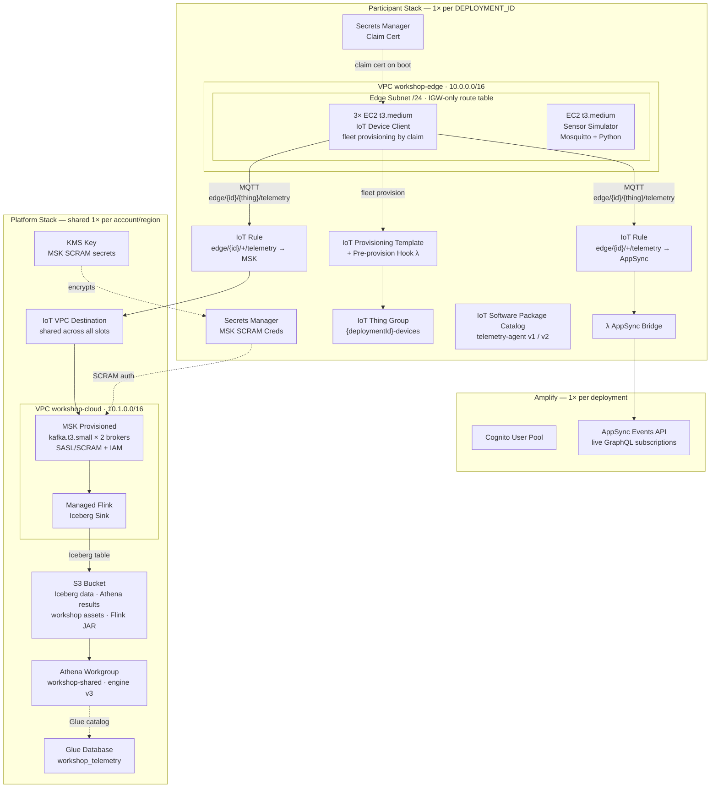

---
hide:
  - navigation
  - toc
---

# Prerequisites — Admin Platform Deployment

!!! warning "Admin only"
    This step is performed by a cloud admin **before Session 1**. Participants never touch this step.

The entire workshop runs on an AWS Amplify Gen 2 project. The Amplify project is the deployment root — it deploys custom CDK constructs via `amplify/backend.ts`, then adds application-layer resources (Cognito, AppSync Events API, S3 hosting) on top.

---

## Architecture Overview



## What Gets Deployed

Each participant slot gets a unique **`DEPLOYMENT_ID`** (e.g., `ws-a1b2c3`). All resource names and MQTT topic paths are namespaced with this ID to avoid cross-slot conflicts.

| Resource | Config | Notes |
|---|---|---|
| VPC `workshop-edge` | 1× per account, shared | 10.0.0.0/16; checked for existence before create |
| VPC `workshop-cloud` | 1× per account, shared | 10.1.0.0/16; checked for existence before create |
| Edge subnets (`/24`) | 1× per deployment | Route table: IGW only; no cross-subnet routes |
| Cloud subnets | 1× per deployment | Standard routing |
| EC2 instances (t3.medium) | 3× per deployment | User data installs IoT Device Client; fleet provisioning by claim |
| IoT Provisioning Template | 1× per deployment | Claim cert embedded via Secrets Manager |
| IoT Thing Group | 1× per deployment | Dynamic group: `deploymentId = ws-slot00` |
| MSK Provisioned cluster | 1× per deployment | `kafka.t3.small` × 2 brokers; SASL/SCRAM |
| EKS cluster | 1× per deployment | In `workshop-cloud` VPC; 2× `t3.medium` nodes; Session 4 |
| IoT Rule (S3) | 1× per deployment | Routes `edge/ws-slot00/+/telemetry` → S3 JSON; Athena sessions 1–3 |
| IoT Rule (MSK) | 1× per deployment | Same topic → Lambda → MSK `raw.telemetry`; Session 4 |
| S3 bucket | 1× per deployment | IoT Rule writes JSON; Glue + Athena pre-created; Helm assets staged |
| Athena workgroup | 1× per deployment | Engine v3; participants `AssumeRole` into it |
| Amplify app + hosting | 1× per account, shared | Cognito user pool per deployment; AppSync Events API |

!!! info "VPC count"
    **2 shared VPCs total** (edge + cloud), regardless of participant count. Well within the default 5-VPC limit.

**Estimated cold deploy time:** 45–60 min (MSK + EKS dominate). Pre-deploy the night before.

---

## Deploy Steps

```bash
# 1. Clone and install
git clone https://github.com/your-org/edge-digital-ops-workshop
cd edge-digital-ops-workshop
pnpm install

# 2. Bootstrap CDK (first time only per account/region)
npx cdk bootstrap

# 3. Deploy all participant environments in parallel
#    Deploys the shared platform stack once first (if needed),
#    then starts one Amplify sandbox per participant concurrently.
pnpm sandbox:all ws-a1b2c3 ws-b4c5d6
```

!!! info "What `pnpm sandbox:all` does"
    `scripts/sandbox-all.sh` deploys `WorkshopPlatformStack` (shared VPCs) sequentially first — eliminating any race condition — then fans out `npx ampx sandbox --identifier <ID>` for each participant in parallel. Each participant gets their own isolated full-stack Amplify environment. Logs are prefixed with `[ws-a1b2c3]` etc. for readability.

!!! tip "Single participant"
    To deploy or iterate on one environment: `pnpm sandbox ws-a1b2c3`

---

## Initial Telemetry Configuration

Devices publish OS metrics as soon as they register.

- **Frequency:** 0.2 Hz (one message every 5 seconds)
- **Metrics published:** `cpu_pct`, `mem_used_pct`, `disk_used_pct` — _network I/O intentionally omitted until Session 2_
- **Topic pattern:** `edge/ws-slot00/{THING_NAME}/telemetry`

```json
{
  "state": {
    "reported": {
      "telemetry_interval_ms": 5000,
      "metrics": ["cpu_pct", "mem_used_pct", "disk_used_pct"],
      "config_version": "1.0.0"
    }
  }
}
```

**Clock sync:** All EC2 instances use the Amazon Time Sync Service (`169.254.169.123`, Chrony). Data freshness is computed as `current_timestamp - message_timestamp` where `message_timestamp` is the Unix epoch embedded in each MQTT payload.

---

## References

- [Amplify Gen 2 custom CDK backends](https://docs.amplify.aws/react/build-a-backend/add-aws-services/custom-resources/)
- [AppSync Events HTTP publish](https://docs.aws.amazon.com/appsync/latest/eventapi/publish-http.html)
- [IoT Fleet Provisioning by claim](https://docs.aws.amazon.com/iot/latest/developerguide/provision-wo-cert.html)
- [IoT Rules Engine Kafka action](https://docs.aws.amazon.com/iot/latest/developerguide/apache-kafka-rule-action.html)
