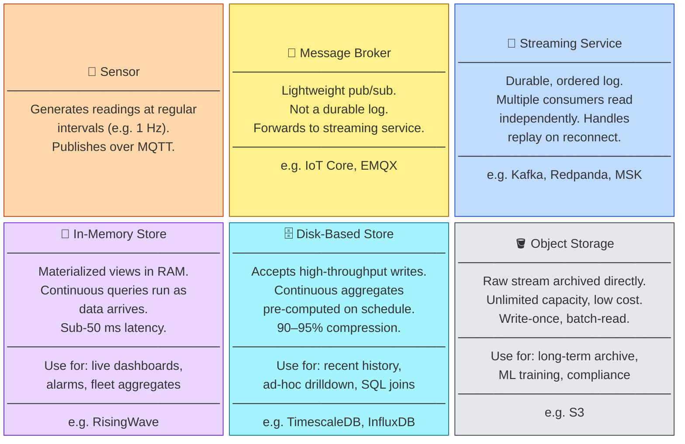
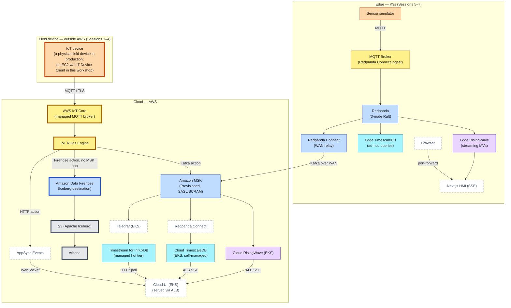

---
hide:
  - navigation
  - toc
---

# Session 1 — Observe: The Data in Motion

**Duration:** 4 hours  
**Goal:** Understand how devices register into IoT Core, then trace the full data path from EC2 → IoT Core → Firehose → S3 → Athena and measure data freshness.

!!! note "Why IoT Core is the front door here"
    This session sends telemetry into AWS through **AWS IoT Core** — the managed MQTT broker. That's a deliberate architecture choice, not the only one: devices can also be Kafka producers straight into MSK, or publish through an edge Redpanda cluster that relays to MSK (which you'll build in Sessions 5–7). IoT Core wins here because it's fully managed and unlocks the fleet-management features this workshop leans on next — Jobs, device shadows, and fleet provisioning. The full three-way comparison, and how to pick per device, is in the [capstone architecture review](../07-capstone/block-1-architecture.md#choosing-your-aws-entrypoint-iot-core-vs-msk).

---

## The Mental Model: Sensor → Broker → Streaming → Storage

Every real-time sensor pipeline — cloud, on-premises, or edge — is a variation of the same handful of roles. Learn these once and every box in the architecture that follows falls into place. **The colors here carry through to the pipeline diagram below.**

The pattern holds whether the pipeline runs on a rig at the edge or entirely in the cloud — only the specific products change.

---

## The Full Pipeline — Where Session 1 Fits

This is the complete edge-to-cloud pipeline you'll build across all seven sessions, with **every box tinted by its role from the model above** — orange sensors, yellow brokers, blue streaming, purple in-memory stores, cyan disk stores, grey object storage. Supporting glue that isn't one of those roles — connectors, dashboards, and the live-push API — is drawn as dashed white boxes. **Session 1 exercises the bold-outlined path:** EC2 devices publish to AWS IoT Core, an IoT Rule fans telemetry to Amazon Data Firehose, and Firehose lands it as Apache Iceberg files in S3 for Athena to query. The rest — the edge K3s stack, MSK, and the live analytics tiers (RisingWave, TimescaleDB, Timestream for InfluxDB, AppSync) — arrives in later sessions.

On this direct path the **only** component outside AWS is the device itself. In production that's a physical field device; in this workshop it's an EC2 instance running the IoT Device Client, purely because everything here deploys into an AWS account. AWS IoT Core and the Rules Engine are managed AWS services and live in the cloud.

---

## Session Overview

| Block | Duration | Topic |
|---|---|---|
| [Block 0](block-0-fleet-provisioning.md) | 45 min | Fleet Provisioning — how devices got into IoT Core |
| [Block 1](block-1-console-tour.md) | 45 min | Orientation & Console Tour — subscribe to live telemetry |
| [Block 2](block-2-s3.md) | 45 min | S3 Observation — Iceberg files written by Firehose |
| [Block 3](block-3-athena.md) | 60 min | Athena Data Freshness Query |
| Wrap-up | 15 min | Recap + preview Session 2 |

---

## What You Need

- Your `DEPLOYMENT_ID` from the facilitator (format: `ws-a1b2c3`)
- AWS console access with the workshop IAM role assumed

---

## Key Takeaway

By the end of this session you will have measured the **data freshness** of the archive tier (Iceberg/Athena: tens of seconds up to ~300 seconds, governed by Firehose's buffering interval) and understood why it cannot serve a live operational dashboard. This sets up the motivation for the higher-frequency tiers introduced in Sessions 3–4.
