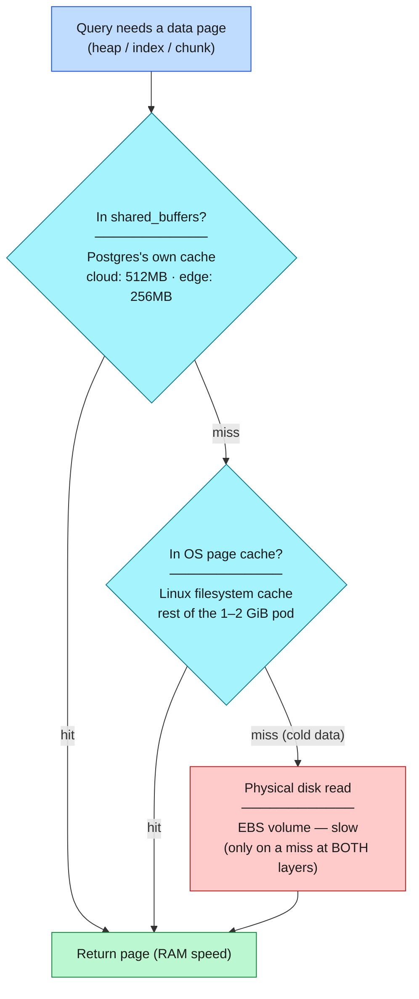
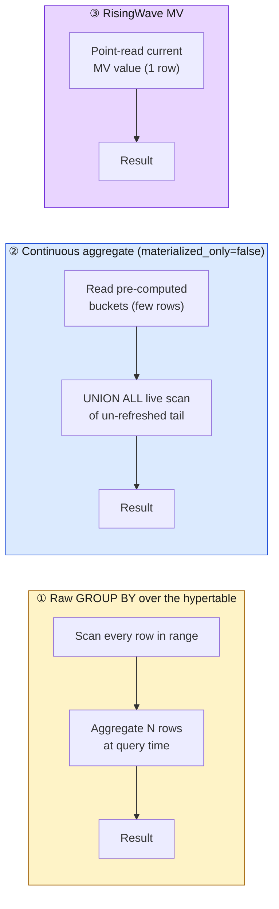
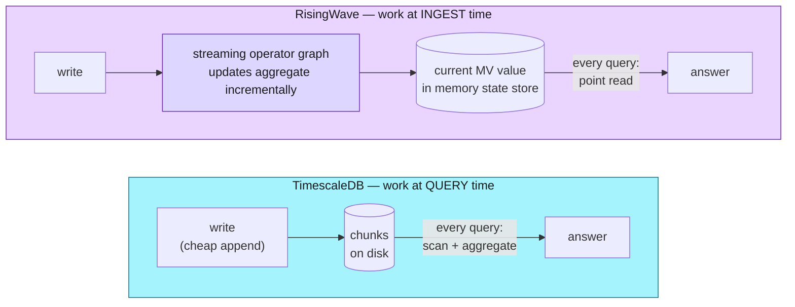

# Block 4 — TimescaleDB: Cheap Writes, Continuous Aggregates, and the Read-Time Bargain

**Duration:** 45 min

TimescaleDB is the "on-disk time-series" substrate from the [Block 1](block-1-storage.md)
storage tour. Its whole personality is one trade-off: it keeps the **write** path
trivially cheap (an append — nothing is pre-computed) and defers all the aggregation
work to **read** time. This block is about that bargain, and about the one knob —
the *continuous aggregate* — that lets you shift the complexity back toward write
time when a read gets too expensive. Contrast it with [Block 2](block-2-risingwave.md)
(RisingWave), which makes the opposite choice.

---

## The data model in one table

All telemetry lands in a single hypertable:

```
sensor_readings(ts_ms, sensor, site_id, deployment_id, value, unit, partition_time)
```

One row per metric per reading. CPU readings arrive as rows where `sensor = 'cpu_pct'`,
with `site_id` the reporting thing name. This is the "cheap write" in action — the
device just appends narrow rows; nothing is rolled up, indexed into a cube, or
propagated through a compute graph on the way in. Everything interesting happens
later, when you query.

!!! info "One shared hypertable, filtered by `deployment_id`"
    This TimescaleDB cluster is **one shared instance for the whole workshop**, not one
    per slot — `sensor_readings` holds every slot's rows in the same hypertable.
    `deployment_id` leads a composite index (`idx_sensor_readings_deployment`) precisely
    so a `WHERE deployment_id = 'ws-slot00'` predicate stays index-scoped instead of
    scanning every slot's data — add it to every query below.

## Connect and query

With a port-forward to the cluster's read-write service open, connect with `psql`:

```bash
kubectl port-forward -n cloud-analytics svc/timescaledb-cloud-rw 5432:5432 &
PGPASSWORD="$TSDB_PASS" psql -h localhost -p 5432 -U workshop -d edge -c "SELECT 1;"
```
<!-- e2e:assert {"contains": "1 row"} -->

!!! tip "Port 5432 already in use?"
    If you have a local PostgreSQL running, `psql -h localhost -p 5432` connects to *it*, not the forward. Map the forward to a free local port instead — `kubectl port-forward … 15432:5432` — and connect with `-p 15432`.

## Create a Continuous Aggregate — buying back read cost

A raw `GROUP BY time_bucket(...)` re-scans and re-aggregates every underlying row
*on every query* — that's the read-time cost of cheap writes. A **continuous
aggregate (CAGG)** is TimescaleDB's lever to move that complexity back toward write
time: it pre-materialises the buckets and keeps them current with a background
refresh policy, so the read becomes a flat lookup of a few rows instead of a scan
of thousands.

!!! warning "Name your CAGG with your slot — this database is shared"
    Every participant runs this exercise against the **same shared** TimescaleDB
    instance (#253). If everyone names their view `cpu_hourly`, the second participant's
    `CREATE MATERIALIZED VIEW IF NOT EXISTS` silently no-ops and reuses the *first*
    participant's object instead of creating their own. Suffix the name with your slot
    (hyphens aren't valid in a Postgres identifier, so `ws-slot00` becomes `ws_slot00`) —
    the examples below already do this.

```sql
-- Hourly CPU summary, this slot only — pre-computes buckets so reads don't
-- re-aggregate raw rows. Slot-prefixed name + deployment_id filter avoid
-- colliding with every other participant's object in the shared database.
CREATE MATERIALIZED VIEW cpu_hourly_ws_slot00
WITH (timescaledb.continuous) AS
SELECT
  time_bucket('1 hour', partition_time) AS bucket,
  site_id,
  AVG(value) AS avg_cpu,
  MAX(value) AS max_cpu
FROM sensor_readings
WHERE sensor = 'cpu_pct'
  AND deployment_id = 'ws-slot00'
GROUP BY bucket, site_id;

-- Refresh policy — this is where the deferred write-time work is scheduled
SELECT add_continuous_aggregate_policy('cpu_hourly_ws_slot00',
  start_offset      => INTERVAL '3 hours',
  end_offset        => INTERVAL '1 hour',
  schedule_interval => INTERVAL '30 minutes');
```

Run it against the cluster with `psql` (`IF NOT EXISTS` / `if_not_exists => true`
make it safe to re-run):

```bash
PGPASSWORD="$TSDB_PASS" psql -h localhost -p 5432 -U workshop -d edge -v ON_ERROR_STOP=1 <<'SQL'
CREATE MATERIALIZED VIEW IF NOT EXISTS cpu_hourly_ws_slot00
WITH (timescaledb.continuous) AS
SELECT time_bucket('1 hour', partition_time) AS bucket,
       site_id,
       AVG(value) AS avg_cpu,
       MAX(value) AS max_cpu
FROM sensor_readings
WHERE sensor = 'cpu_pct'
  AND deployment_id = 'ws-slot00'
GROUP BY bucket, site_id;

SELECT add_continuous_aggregate_policy('cpu_hourly_ws_slot00',
  start_offset      => INTERVAL '3 hours',
  end_offset        => INTERVAL '1 hour',
  schedule_interval => INTERVAL '30 minutes',
  if_not_exists     => true);
SQL
```
<!-- e2e:assert {"contains": "CREATE MATERIALIZED VIEW"} -->

---

## Enable Real-Time Aggregation

By default the CAGG is `materialized_only = true` — data newer than the last refresh is silently excluded. Enable real-time aggregation to fill the gap:

```sql
ALTER MATERIALIZED VIEW cpu_hourly_ws_slot00
  SET (timescaledb.materialized_only = false);
```

With this set, a plain `SELECT` is transparently rewritten by the query planner:

```sql
-- What the planner actually executes:
SELECT * FROM <materialization_hypertable>
UNION ALL
SELECT time_bucket('1 hour', partition_time), site_id,
       AVG(value), MAX(value)
FROM sensor_readings
WHERE sensor = 'cpu_pct'
  AND partition_time > <materialization_watermark>
GROUP BY 1, 2;
```

This is structurally identical to **Iceberg's merge-on-read**: the materialization hypertable is the committed data file, the raw un-refreshed chunks are the uncommitted delta, and the query-time UNION ALL is the merge reader that reconciles them at query time.

---

## The read complexity you can't refresh away

Real-time aggregation narrows the freshness gap, but look again at what that planner
rewrite actually does: it `UNION ALL`s a **live scan of the un-refreshed tail** onto
the pre-materialised buckets. That live scan *is* read-time aggregation — the very
cost the CAGG was supposed to remove. So a continuous aggregate doesn't **eliminate**
read complexity; it **bounds** it to whatever hasn't been refreshed yet. There's
always a residual scan on every read.

And how small can that tail get? Only as small as the **refresh policy allows**. A
CAGG stays current through a *scheduled background job* (`schedule_interval` above),
and that interval has a practical floor: each refresh scans the modified buckets and
rewrites the materialization, so you can't crank it arbitrarily fast without refreshes
overlapping and competing with the write path. The un-refreshed tail — and thus the
residual read scan and the freshness lag — can shrink, but never to zero.

RisingWave has no such floor. It doesn't *refresh* on a schedule at all — it maintains
each view **incrementally, row by row, as every event arrives**, with no background
job in the loop:

- **Freshness is truly continuous** — sub-second/millisecond — not quantised by a
  refresh interval.
- **The read is a pure point lookup** — there is no residual tail to scan, ever.

That is the sharp end of the read-vs-write-complexity trade. A CAGG shifts *most* of
the aggregation to write time but, because its refresh is scheduled and bucketed,
always leaves a residual read-time scan behind. RisingWave shifts *all* of it, because
incremental streaming maintenance has no minimum refresh granularity to leave a tail.
TimescaleDB can get **close** to a pure keyed-lookup read — it just can't get all the
way there the way a native streaming engine does.

---

## Workshop Exercise

Compare freshness with real-time aggregation on vs off:

```sql
-- With materialized_only = true: latest bucket may be ~1h stale
SELECT MAX(bucket) AS latest_bucket FROM cpu_hourly_ws_slot00;

-- After ALTER ... SET (timescaledb.materialized_only = false):
-- Latest bucket now reflects data up to NOW()
SELECT MAX(bucket) AS latest_bucket FROM cpu_hourly_ws_slot00;
```

---

## RisingWave MV vs TimescaleDB CAGG

| | TimescaleDB CAGG (`materialized_only=false`) | RisingWave MV |
|---|---|---|
| Freshness | Current at query time — live scan covers gap | Current continuously — incremental update on every write |
| Query latency (fresh data) | Higher — must scan + aggregate recent raw chunks | Low — always reading pre-computed state |
| Write-path cost | Near-zero — appends only | Higher — every write propagates through the MV DAG |
| Analogy | Iceberg merge-on-read (merge at read time) | Iceberg copy-on-write with no lag |

---

## Under the hood — when is data read from cache vs disk?

The table above says RisingWave reads are "low latency" and TimescaleDB reads are
"higher." *Why* is the whole point of this workshop's freshness panel. The answer
is not "one is in RAM and the other is on disk" — TimescaleDB's hot data is in RAM
too. The real difference is **when the aggregation work happens**: TimescaleDB
does it at *query time*, RisingWave does it at *ingest time*.

### TimescaleDB is Postgres — so it has a two-layer cache

TimescaleDB is a Postgres extension, so a read goes through Postgres's normal
storage path. There are **two** caches in front of the physical disk, and **both
are in memory**:



- **`shared_buffers`** — Postgres's own in-process cache of 8 KB pages (this
  cluster: `512MB` cloud / `256MB` edge, set in the CNPG cluster spec). This is
  "the database cache."
- **OS page cache** — Postgres uses buffered I/O, so even a "disk" read usually
  comes from the kernel's filesystem cache in whatever RAM is left of the pod's
  1–2 GiB limit. `effective_cache_size` (`1536MB` cloud) is the planner's *estimate*
  of these two layers combined — a hint, not an allocation.
- A **true physical (EBS) disk read** happens only on a miss at *both* layers —
  i.e. for **cold data** that hasn't been touched recently.

So for a hot time-series workload (the last few seconds/minutes of telemetry), the
pages are almost always already in RAM. **"Is the cache in memory?" — yes, both
layers are.**

### When you run an aggregation, is the disk always read?

No. But caching only decides whether the *input pages* are in RAM — it does **not**
remove the per-query CPU work of aggregating the rows. That distinction is the
crux. There are three read shapes:



- **① Raw `GROUP BY time_bucket(...)`** — Postgres scans every underlying row in
  the range and aggregates them *on every query*. Whether the scan touches disk
  depends on caching (recent = cached = fast; old = cold = disk), **but the CPU
  cost of aggregating N rows is paid every single time regardless.** Caching removes
  the I/O, not the compute.
- **② Continuous aggregate** (`cpu_hourly` above) — reads the already-materialized
  buckets (few rows), then `materialized_only=false` UNIONs a *live scan of only the
  un-refreshed tail*. Far less compute than ①, but freshness lags by up to the
  refresh interval, and the tail-scan cost is still real.
- **③ RisingWave MV** — the value is already computed; a read is a single point
  lookup. No scan, no aggregation at read time.

!!! warning "The other disk-read path: `work_mem` spills"
    A large raw `GROUP BY` also builds its hash/sort table in memory up to
    `work_mem` (`8MB` cloud / `4MB` edge). Exceed that and Postgres **spills the
    aggregation to temp files on disk** — a disk read that has nothing to do with
    whether the *input* was cached. Big ad-hoc aggregations hit this; RisingWave
    never does, because it doesn't build a transient hash at read time.

### RisingWave computes at ingest, not at read

RisingWave is not caching the same query — it *eliminates* the query. It maintains
each materialized view **incrementally**: every arriving row updates the aggregate
in its (memory-backed) state store, so the current answer is always already sitting
there. Work is amortized across the ingest stream instead of paid per query.



| | TimescaleDB | RisingWave |
|---|---|---|
| Aggregate computed **when**? | At query time (raw), or at refresh time (CAGG) | At ingest time, incrementally, per event |
| What's held in memory? | *Input pages* (shared_buffers + OS cache) | *The materialized result* + operator state |
| Cost of one read | Scan + aggregate, or read CAGG rows | Point read of the current value |
| Cost of one write | Near-zero (append) | Higher — propagates through the MV graph |

### So when is RisingWave's in-memory model actually superior?

Not simply "because it's in RAM." It wins specifically when:

1. **You need continuous freshness *and* cheap reads at once.** TimescaleDB forces
   a trade-off — raw is fresh but expensive per read; a CAGG is cheap per read but
   stale by the refresh interval, and even with real-time aggregation on, it still
   pays a residual scan of the un-refreshed tail (see
   [The read complexity you can't refresh away](#the-read-complexity-you-cant-refresh-away)).
   RisingWave gives both, because the work is already done at ingest.
2. **Reads are frequent.** The freshness panel fires a query on *every* incoming
   event (the AppSync-as-clock pattern). TimescaleDB pays the scan/aggregate cost
   per fire; RisingWave already holds the answer.
3. **The aggregation is complex or the raw range is large** — exactly the case
   where a cached-but-still-huge scan (or a `work_mem` spill) bites.

**TimescaleDB wins** for ad-hoc historical queries over ranges nobody
pre-declared (RisingWave only maintains the MVs you defined up front), rich SQL /
joins / indexing, compression, and being the durable system of record. RisingWave's
memory footprint also grows with the *state* it must keep (group cardinality × window
size), so a huge keyspace costs RAM.

!!! example "See it in the numbers"
    The dashboard's freshness query (`cloud-dashboard/src/lib/freshness-queries.ts`)
    against the raw `sensor_readings` hypertable dropped from **~1.8 s** (full scan of
    ~6.9 M rows, dragging cold chunks off disk) to **~11 ms** just by adding
    `WHERE partition_time > now() - interval '15 minutes'` — which keeps the scan
    inside recent, *cached* chunks. That 150× swing **is** the cache-vs-disk story.
    RisingWave's side of the same panel reads the pre-collapsed `mv_sensor_fleet_latest`
    in a point read — so its latency **doesn't** swing, because there's no scan to
    cache.

**The one-liner:** TimescaleDB caches the *data* and aggregates on demand;
RisingWave caches the *answer* and updates it on arrival. Caching in Postgres
removes disk I/O but not per-query compute — RisingWave removes the per-query
compute entirely by shifting it to ingest.

---

## Wrap-Up

Recap the three-tier freshness ladder: **RisingWave** (sub-second) → **TimescaleDB** (seconds) → **Iceberg/Athena** (tens of seconds up to ~300 seconds, set by Firehose's buffering interval).

**Preview Sessions 5–7:** Edge Kubernetes stack, simulated industrial site, and the HMI operator interface.

---

## References

- [TimescaleDB continuous aggregates](https://docs.timescale.com/use-timescale/latest/continuous-aggregates/)
- [TimescaleDB real-time aggregation](https://docs.timescale.com/use-timescale/latest/continuous-aggregates/real-time-aggregates/)
