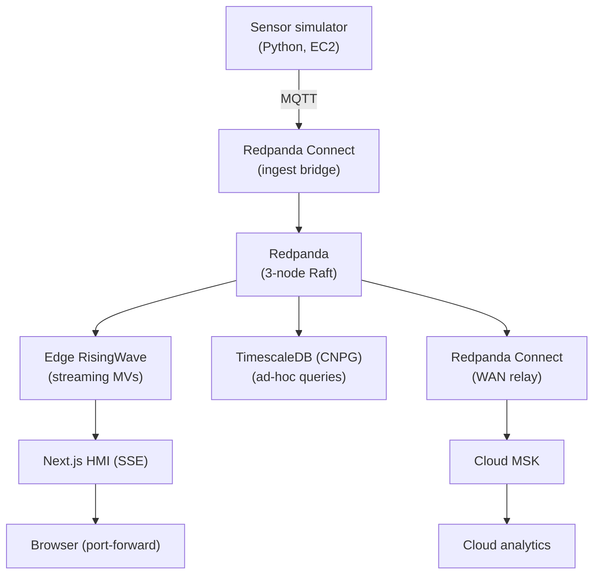

# Block 1 — Edge Stack Architecture Review

**Duration:** 30 min

---

## Architecture Overview

Review the full edge stack from [docs/notes/real-time-pipeline-architecture.md](../reference/architecture.md):

---

## Which Ingest Path to Use

Sessions 1–4 published telemetry straight to AWS IoT Core. This session adds a second path: the edge Redpanda cluster relaying to MSK. Both paths land in the **same** MSK cluster and feed the same downstream consumers — they are not mutually exclusive. The question is which one fits a given device's connectivity profile.

| | Direct cloud ingest (IoT Core) | Edge Redpanda → MSK relay |
|---|---|---|
| **WAN required to operate** | Yes — device must reach IoT Core to publish at all | No — Redpanda buffers locally; relay catches up on reconnect |
| **Handles intermittent WAN** | No — messages dropped if IoT Core is unreachable | Yes — Redpanda's Kafka offset model guarantees no data loss across outages |
| **Edge-local dashboard** | No — data only exists in the cloud | Yes — Edge RisingWave and TimescaleDB serve dashboards from local data regardless of cloud connectivity |
| **Broker dependency** | AWS IoT Core (AWS-managed) | Redpanda (open source, self-hosted on your hardware) |
| **Architecture approach** | Faster time to value — fully managed by AWS; no edge infrastructure to operate | Open architecture — Kafka-compatible interface decouples the edge stack from the cloud backend |
| **Per-device throughput cap** | 100 msg/s hard limit per connection | No practical cap — Redpanda handles hundreds of thousands of msg/s on NVMe |
| **Fleet management (Jobs, shadows)** | Native — built into IoT Core | Not included — requires a separate management plane |
| **Setup complexity** | Low — IoT Core is fully managed | Higher — K3s cluster + Helm stack to operate |

### When to use direct IoT Core ingest

- Device has a **stable, always-on internet connection** (office sensor, fixed infrastructure)
- You need **IoT Jobs, device shadows, or fleet provisioning** — these are IoT Core features with no Redpanda equivalent
- Low publish frequency (≤100 msg/s per device) and no offline survival requirement
- You want minimal operational overhead and are comfortable with the AWS dependency

### When to use the Redpanda → MSK relay

- Device is at a **remote or intermittently connected site** (offshore rig, wellsite, field equipment)
- You need **offline-resilient local dashboards** — operators must see live data even when the WAN link is down
- High-frequency sensors (vibration, acoustic) that exceed IoT Core's per-connection throughput cap
- You want **open architecture** — the Kafka-compatible interface means you can route edge data to any cloud backend (AWS MSK today, Azure Event Hubs or on-prem Kafka tomorrow) without changing the edge stack

!!! info "How this workshop uses both"
    Sessions 1–4 use direct IoT Core ingest because the workshop EC2 instances have stable internet and the sessions focus on IoT Core features (fleet provisioning, Jobs, shadows). Sessions 5–7 layer the Redpanda edge stack on top of the same devices to show what the full resilient architecture looks like — both paths feed the same MSK cluster throughout.

---

## No GraphQL Server at the Edge

The cleanest pattern for the edge HMI:

- **Live sensor data (Site View):** Next.js Route Handlers open a `pg` connection directly to Edge RisingWave, issue a `SUBSCRIBE` cursor, and stream results to the browser as **Server-Sent Events (SSE)**
- **Ad-hoc / historical queries (Digital Ops page):** Next.js Route Handlers connect to TimescaleDB on demand

RisingWave supports the PostgreSQL wire protocol, so `node-postgres` connects directly — no sidecar, no PostGraphile, no extra container.

---

## References

- [RisingWave `SUBSCRIBE` docs](https://risingwavelabs.mintlify.app/delivery/subscription)
- [RisingWave PostgreSQL wire protocol](https://risingwave.com/blog/mcp-streaming-database-connect-ai-agents-risingwave/)
