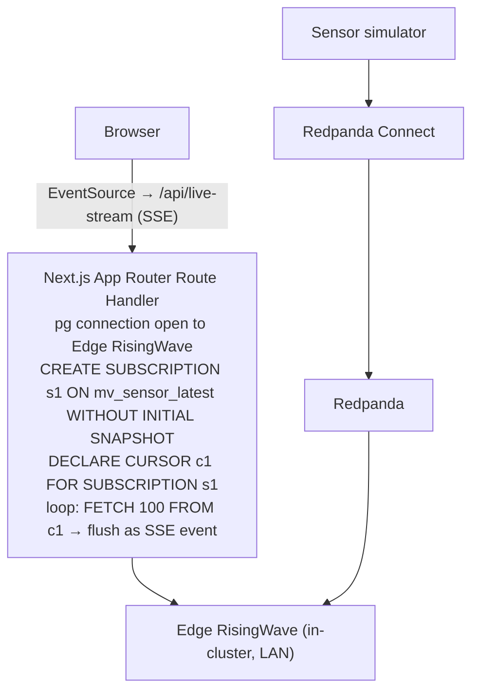

# Block 1 — Port-Forward and Load the HMI

**Duration:** 30 min

---

## Port-Forward

```bash
kubectl port-forward -n edge svc/edge-stack-hmi 3000:3000 > /tmp/hmi-pf.log 2>&1 &
HMI_PF_PID=$!
# Wait for the forward to bind rather than racing a fixed sleep.
until grep -q "Forwarding from" /tmp/hmi-pf.log 2>/dev/null; do sleep 1; done
curl -sf http://localhost:3000 | head -c 200
kill "$HMI_PF_PID" 2>/dev/null || true
```
<!-- e2e:assert {"contains": "<"} -->

Or keep the port-forward running in a separate terminal and open `http://localhost:3000` in a browser.

---

## Live Data Delivery Architecture

The HMI uses a direct PostgreSQL wire subscription — no GraphQL layer, no polling:



The browser `EventSource` client receives updates and re-renders the React Flow node that owns that sensor. Effective latency: ~100–300 ms LAN.

---

## References

- [React Flow](https://reactflow.dev/)
- [RisingWave SUBSCRIBE docs](https://risingwavelabs.mintlify.app/delivery/subscription)
