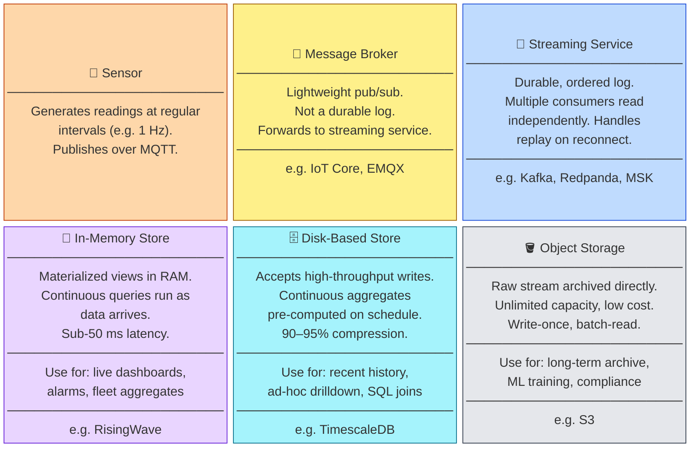
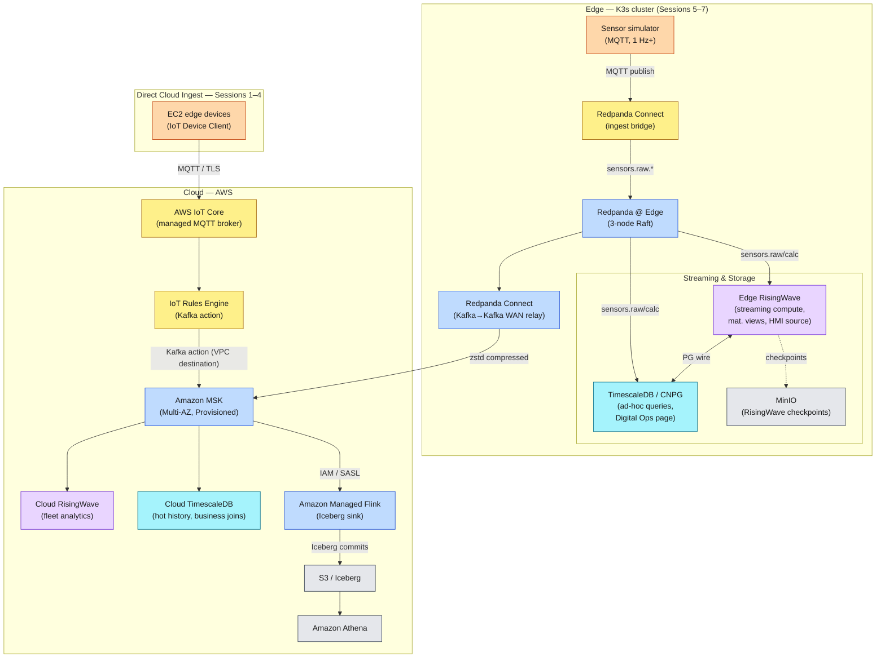

---
hide:
  - navigation
  - toc
---

# Edge Digital Operations Workshop

**Format:** 4-hour sessions · Once per week · 7 weeks  
**Audience:** Engineers familiar with the AWS console and basic Linux  
**Prerequisite:** A cloud admin deploys the platform stack before Session 1

---

## Mental Model: The Four-Layer Pipeline

Every real-time sensor pipeline — regardless of cloud provider, on-premises or edge — is a variation of the same four-layer model. Understanding this model first makes every architectural decision in the workshop follow naturally.

The rest of this workshop maps real AWS and open-source components onto each box. **The pattern stays the same whether the pipeline runs on a rig at the edge or entirely in the cloud.**

### Why these layers exist

The layers solve distinct problems that no single system handles well:

- **Broker** (IoT Core, EMQX) — accepts MQTT connections from thousands of devices, handles TLS termination, fan-out to subscribers. Not durable: messages that miss their subscriber window are gone.
- **Streaming service** (MSK, Redpanda) — fills the durability gap. Multiple independent consumers (RisingWave, TimescaleDB, S3 connector) each maintain their own read offset and can fall behind or replay without affecting each other. The broker feeds this layer; the streaming service is what makes the downstream consumers decoupled.
- **In-memory store** (RisingWave) — continuously maintains pre-computed aggregations *in RAM*. Queries hit pre-computed state — no row scan, no disk I/O. Freshness is ~100–300 ms from the stream. The cost is that raw history isn't stored here — only the views you defined.
- **Disk-based store** (TimescaleDB) — accepts high-throughput appends from the stream and compresses them aggressively (90–95% on regular sensor data). Serves ad-hoc queries, time-range drilldowns, and joins against business data. Freshness lags slightly (seconds) because it materializes aggregates on a schedule rather than on every write.
- **Object storage** (S3) — writes the raw stream once, forever. No query engine of its own; Athena bridges the gap. Cost-effective for compliance, ML training, and long-horizon analytics. Data freshness floor is ~30–90 seconds (MSK Connect flush interval + table format commit).

---

## Full Architecture

This workshop builds the following pipeline. The two paths (edge cluster and direct cloud ingest) both land in the same MSK cluster and the same downstream consumers.

### Component Roles

| Component | Role | Where in workshop |
|---|---|---|
| **AWS IoT Core** | Managed MQTT broker for cloud-connected devices; fleet provisioning; device shadows; IoT Jobs | Sessions 1–4 |
| **IoT Rules Engine** | Routes MQTT messages directly to MSK via a VPC Kafka action — no Lambda hop needed | Sessions 1–4 |
| **Amazon MSK** | Cloud-side stream buffer; raw stream written to S3; feeds RisingWave and TimescaleDB | Sessions 1–4 |
| **Managed Flink Iceberg Sink** | Writes raw telemetry from MSK to S3 as an Apache Iceberg table; auto-registers in Glue catalog | Session 1 |
| **Amazon Athena** | Query engine over the Iceberg table; measures the archive-tier freshness floor | Session 1 |
| **Cloud RisingWave** | Fleet analytics; continuously maintained materialized views; sub-100 ms query latency | Session 4 |
| **Cloud TimescaleDB** | Hot-tier history (days–weeks); continuous aggregates; ad-hoc SQL; business data joins | Session 4 |
| **Redpanda @ Edge** | Durable stream buffer at the edge; offline replay when WAN is down | Sessions 5–7 |
| **Redpanda Connect (ingest)** | Bridges MQTT → Redpanda at the edge | Sessions 5–7 |
| **Redpanda Connect (relay)** | Forwards edge Redpanda → Cloud MSK; resumes from committed offset after WAN recovery | Sessions 5–7 |
| **Edge RisingWave** | Streaming compute at the edge; powers the HMI live sensor panels via SSE | Sessions 5–7 |
| **Edge TimescaleDB** | Durable time-series at the edge; powers the Digital Ops page | Sessions 5–7 |
| **Next.js HMI** | P&ID-style operator interface; Site View (React Flow) + Digital Ops metrics page | Sessions 6–7 |

---

## Which Ingest Path to Use

Both paths in the architecture diagram land in the same MSK cluster and feed the same downstream consumers — they are not mutually exclusive. The question is which one fits a given device's connectivity profile.

| | Direct cloud ingest (IoT Core) | Edge Redpanda → MSK relay |
|---|---|---|
| **WAN required to operate** | Yes — device must reach IoT Core to publish at all | No — Redpanda buffers locally; relay catches up on reconnect |
| **Handles intermittent WAN** | No — messages dropped if IoT Core is unreachable | Yes — Redpanda's Kafka offset model guarantees no data loss across outages |
| **Edge-local dashboard** | No — data only exists in the cloud | Yes — Edge RisingWave and TimescaleDB serve dashboards from local data regardless of cloud connectivity |
| **Broker dependency** | AWS IoT Core (AWS-managed) | Redpanda (open source, self-hosted on your hardware) |
| **Architecture approach** | Faster time to value — fully managed by AWS; no edge infrastructure to operate | Open architecture — Kafka-compatible interface decouples the edge stack from the cloud backend |
| **Per-device throughput cap** | 100 msg/s hard limit per connection | No practical cap — Redpanda handles hundreds of thousands of msg/s on NVMe |
| **Fleet management (Jobs, shadows)** | Native — built into IoT Core | Not included — requires a separate management plane |
| **Setup complexity** | Low — IoT Core is fully managed | Higher — K3s cluster + Helm stack to operate |

### When to use direct IoT Core ingest

- Device has a **stable, always-on internet connection** (office sensor, fixed infrastructure)
- You need **IoT Jobs, device shadows, or fleet provisioning** — these are IoT Core features with no Redpanda equivalent
- Low publish frequency (≤100 msg/s per device) and no offline survival requirement
- You want minimal operational overhead and are comfortable with the AWS dependency

### When to use the Redpanda → MSK relay

- Device is at a **remote or intermittently connected site** (offshore rig, wellsite, field equipment)
- You need **offline-resilient local dashboards** — operators must see live data even when the WAN link is down
- High-frequency sensors (vibration, acoustic) that exceed IoT Core's per-connection throughput cap
- You want **open architecture** — the Kafka-compatible interface means you can route edge data to any cloud backend (AWS MSK today, Azure Event Hubs or on-prem Kafka tomorrow) without changing the edge stack

!!! info "How this workshop uses both"
    Sessions 1–4 use direct IoT Core ingest because the workshop EC2 instances have stable internet and the sessions focus on IoT Core features (fleet provisioning, Jobs, shadows). Sessions 5–7 layer the Redpanda edge stack on top of the same devices to show what the full resilient architecture looks like — both paths feed the same MSK cluster throughout.

---

## Which Storage Tier to Query

Three query tiers serve different access patterns. Choosing the wrong tier costs latency (Athena for live queries) or unnecessary complexity (RisingWave for raw history).

| Query Pattern | Right Tier | Why |
|---|---|---|
| Current sensor reading — sub-100 ms required | **RisingWave** | In-memory MV; <50 ms; no disk access |
| Fleet-wide aggregate right now (e.g. total pump rate) | **RisingWave** | MV spans all devices; returns instantly regardless of fleet size |
| Last 7/30/180-day trend chart (hourly buckets) | **TimescaleDB** | Continuous aggregates precompute buckets on write; query scans tiny aggregate table, not raw rows |
| "What happened on this device in the last 48 hours?" | **TimescaleDB** | Hypertable chunk pruning; targeted scan is fast even on raw rows |
| ML training — months of raw sensor history | **Iceberg / Athena** | Full dataset; batch-optimized; cost-effective at scale |
| Compliance audit — raw records since a specific date | **Iceberg / Athena** | Immutable archive; query by time range |

---

## Data Freshness Reference

The workshop makes this ladder directly observable — each tier is wired to a panel in the cloud UI (Session 4) and compared side-by-side with the edge HMI (Session 6).

| Tier | Mechanism | Expected freshness | Scales with fleet? |
|---|---|---|---|
| Live push (IoT → AppSync) | No database — IoT Rules HTTP action → AppSync Events → WebSocket | ~10–80 ms | Flat — per-message cost |
| Edge RisingWave MV (LAN) | SSE via Next.js SUBSCRIBE cursor | ~100–300 ms | Flat |
| Cloud RisingWave MV | SSE via ALB → Next.js SUBSCRIBE cursor | ~300–650 ms | Flat — incremental MV update |
| Edge TimescaleDB CAGG | AppSync Event triggers HTTP request → Next.js Route Handler → Edge TimescaleDB CAGG | ~100–400 ms (LAN) | Flat — edge fleet is fixed at 3 devices |
| Cloud TimescaleDB CAGG | AppSync Event triggers HTTP query → CAGG + live scan | ~100 ms–3 s | Grows: live scan over un-materialized tail |
| Iceberg / Athena | Managed Flink checkpoint + Iceberg commit | ~30–90 s | Grows with data volume |

!!! tip "Why does TimescaleDB freshness grow with fleet size?"
    At 3 devices the CAGG live scan touches ~30 un-materialized rows per query. At 500 devices (5,000 rows/second) the same query scans ~25,000 un-materialized rows — pushing freshness to 500 ms–3 s. RisingWave's MV cost stays flat because it was updated incrementally on every insert: the freshness cost is paid at write time, not read time.

---

## Session Map

| # | Session | Goal |
|---|---------|------|
| Pre | [Admin Setup](00-prerequisites/index.md) | Deploy the platform stack |
| 1 | [Observe — The Data in Motion](01-observe/index.md) | IoT Core → MSK → S3 → Athena |
| 2 | [Control — Fleet Management](02-control/index.md) | IoT Jobs, device update, fleet indexing |
| 3 | [State — Device Shadows & UI](03-state/index.md) | Named shadows, Amplify front end, failure detection |
| 4 | [Analytics — Cloud Telemetry](04-analytics/index.md) | RisingWave MVs, TimescaleDB CAGGs, freshness comparison |
| 5 | [Edge Infrastructure — K3s](05-edge-infra/index.md) | K3s cluster via IoT Job, Helm edge stack |
| 6 | [HMI — Edge Operator Interface](06-hmi/index.md) | P&ID site view, Digital Ops metrics, network failure |
| 7 | [Capstone — Production Path](07-capstone/index.md) | Architecture review, fleet scale, Day-2 ops, teardown |

---

## Before You Begin

Check that you have received your **`DEPLOYMENT_ID`** (format: `ws-a1b2c3`) from the workshop facilitator. You will substitute this value wherever you see `ws-slot00` in the instructions.
