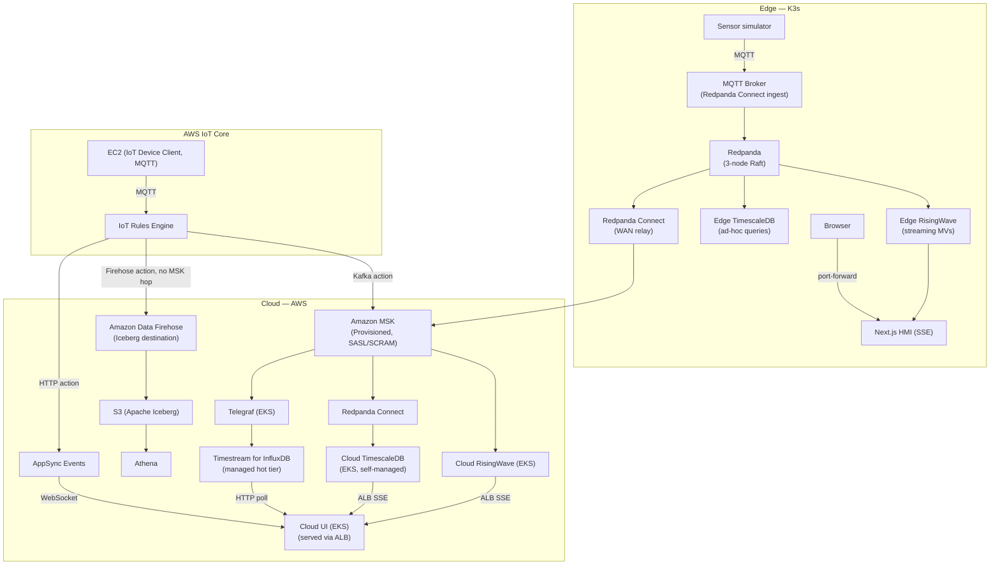

# Architecture Reference

This page summarizes the full edge-to-cloud pipeline architecture. The source document is [docs/notes/real-time-pipeline-architecture.md](https://github.com/aws-samples/sample-edge-to-cloud-digital-ops-workshop/blob/main/docs/notes/real-time-pipeline-architecture.md).

---

## Conceptual Model

Every real-time sensor pipeline is a variation of the same four-layer model:

| Layer | Role | Examples |
|---|---|---|
| Sensor | Generates readings at regular intervals, publishes over MQTT | Field instruments, EC2 simulator |
| Message Broker | Lightweight pub/sub; forwards to streaming service | AWS IoT Core, EMQX |
| Streaming Service | Durable, ordered log; multiple consumers; replay on reconnect | MSK (cloud), Redpanda (edge) |
| In-Memory Store | Materialized views; continuous queries; sub-50 ms latency | RisingWave |
| Disk-Based Store | High-throughput writes; continuous aggregates; compression | TimescaleDB (self-managed), Timestream for InfluxDB (managed) |
| Object Storage | Raw stream archive; unlimited capacity; batch-read | S3 (Apache Iceberg) |

---

## Full Architecture Diagram

